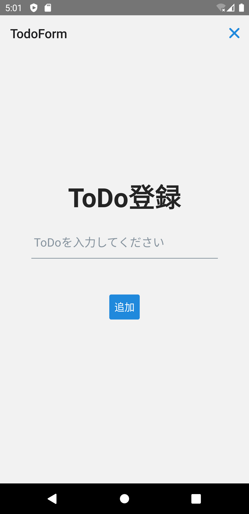

タスク登録画面を実装します。

次のファイルを追加・修正してください。

- `/src/screens/todo/TodoForm.tsx`
- `/src/screens/todo/index.tsx`

```typescript jsx title="/src/screens/todo/TodoForm.tsx"
import {useFormik} from 'formik';
import {useAuthedRootStackNavigation} from 'navigation/hooks';
import React, {useCallback, useEffect} from 'react';
import {Alert, KeyboardAvoidingView, Platform, StyleSheet, View} from 'react-native';
import {Button, Input, Text} from 'react-native-elements';
import {TodoService} from 'services';
import * as Yup from 'yup';

export const TodoForm: React.FC = () => {
  const navigation = useAuthedRootStackNavigation<'TodoForm'>();

  const onAdd = useCallback<(values: {task: string}) => void>(
    async ({task}) => {
      await TodoService.postTodo(task);
      navigation.goBack();
    },
    [navigation],
  );

  const formik = useFormik({
    initialValues: {task: ''},
    validationSchema: Yup.object().shape({
      task: Yup.string().required('タスクを入力してください'),
    }),
    validateOnChange: false,
    onSubmit: onAdd,
  });

  useEffect(() => {
    const unsubscribe = navigation.addListener('beforeRemove', (e) => {
      if (!formik.dirty || formik.isSubmitting) {
        return;
      }
      e.preventDefault();

      Alert.alert('破棄確認', '入力内容が保存されていません。\n入力内容を破棄してよろしいですか？', [
        {text: 'Cancel', style: 'cancel', onPress: () => {}},
        {
          text: 'OK',
          style: 'destructive',
          onPress: () => navigation.dispatch(e.data.action),
        },
      ]);
    });
    return unsubscribe;
  }, [navigation, formik]);

  return (
    <KeyboardAvoidingView
      behavior={Platform.select({
        ios: 'padding',
        android: undefined,
      } as const)}
      style={styles.container}>
      <View style={styles.form}>
        <Text h1>タスク登録</Text>
        <Input
          placeholder="タスクを入力してください"
          containerStyle={styles.input}
          autoCapitalize="none"
          errorMessage={formik.errors.task}
          onChangeText={formik.handleChange('task')}
          value={formik.values.task}
        />
        <Button
          disabled={formik.isSubmitting}
          onPress={() => formik.handleSubmit()}
          title="追加"
          buttonStyle={styles.addButton}
        />
      </View>
    </KeyboardAvoidingView>
  );
};

const styles = StyleSheet.create({
  container: {
    flex: 1,
  },
  form: {
    flex: 1,
    alignSelf: 'stretch',
    alignItems: 'center',
    justifyContent: 'center',
  },
  input: {marginTop: 20, width: '80%'},
  addButton: {
    marginTop: 30,
  },
});
```

React同様に、React Naviveでも`useEffect`にて画面の初期（マウント）時の処理を記述できます。
ここでは、`TodoService.getTodos`メソッドを呼び出してToDo一覧を取得しています。

修正できたら実行してください。
次の操作ができたら成功です。

- 画面にToDoタスクの一覧が表示できる
- チェックボックスをクリックしてタスクの完了状態が更新できる
- ToDoの表示対象を選択して表示を切替できる


