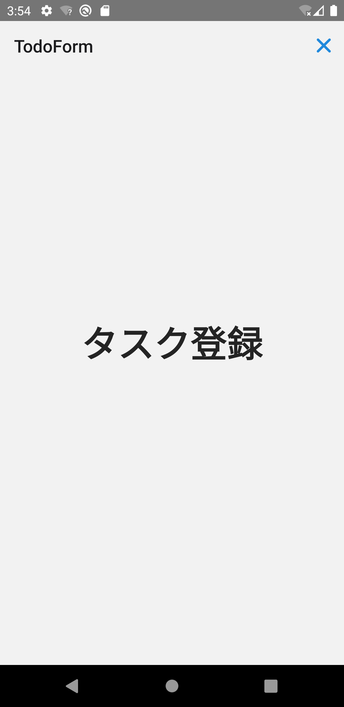

タスク登録画面をモーダル画面として表示しましょう。
モーダルはアニメーションの振る舞いが異なるだけです。
Stackナビゲータの`mode`属性を`modal`に変更（デフォルトは`card`）することで実現できます。

:::note
React Navigation公式ドキュメントの[Opening a full-screen modal](https://reactnavigation.org/docs/modal/)に次の記載があります。
> The modal prop has no effect on Android because full-screen modals don't have any different transition behavior on the platform.

画面遷移アニメーションは、各プラットフォームのネイティブ動作に従います。
上記のとおり、Androidのフルスクリーンモーダルには異なるトランジションが用意されていないため、`mode`属性の変更によるアニメーションの変更はありません。
:::

では実装していきましょう。
`AuthedStackNav`ナビゲータに次の修正を加えます。

- Stackナビゲータの`mode`属性を`modal`に変更
- ヘッダの右にクローズボタンを追加
- ヘッダの背景を非表示（`headerTransparent`を`true`に設定）

まずは、`AuthedStackNav`ナビゲータの`mode`属性を`modal`に変更します。

```diff title="/src/navigation/AuthedStackNav.tsx"
  import {createStackNavigator} from '@react-navigation/stack';
  import React from 'react';
  import {MainTabNav} from 'navigation/MainTabNav';
  import {TodoForm} from 'screens';
  
  const nav = createStackNavigator();
  export const AuthedStackNav: React.FC = () => {
    return (
-     <nav.Navigator screenOptions={{headerShown: false}} initialRouteName="Main">
+     <nav.Navigator screenOptions={{headerShown: false}} initialRouteName="Main" mode="modal">
        <nav.Screen name="Main" component={MainTabNav} />
        <nav.Screen
          name="TodoForm"
          component={TodoForm}
          options={{
            headerShown: true,
          }}
        />
      </nav.Navigator>
    );
  };
```

次に、ヘッダの右にクローズボタンを追加します。

```diff title="/src/navigation/AuthedStackNav.tsx"
+ import {Ionicons} from '@expo/vector-icons';
  import {createStackNavigator} from '@react-navigation/stack';
- import React from 'react';
+ import React, {useCallback, useContext} from 'react';
+ import {Button, ThemeContext} from 'react-native-elements';
  import {MainTabNav} from 'navigation/MainTabNav';
  import {TodoForm} from 'screens';
  
+ const CloseButton: React.FC = () => {
+   const {theme} = useContext(ThemeContext);
+   const navigation = useNavigation();
+   const onClose = useCallback(() => navigation.goBack(), [navigation]);
+ 
+   return (
+     <Button
+       type="clear"
+       icon={<Ionicons name="md-close" color={theme.colors?.primary} size={30} />}
+       onPress={onClose}
+     />
+   );
+ };
+ 
  const nav = createStackNavigator();
  export const AuthedStackNav: React.FC = () => {
    return (
      <nav.Navigator screenOptions={{headerShown: false}} initialRouteName="Main" mode="modal">
        <nav.Screen name="Main" component={MainTabNav} />
        <nav.Screen
          name="TodoForm"
          component={TodoForm}
          options={{
            headerShown: true,
+           headerLeft: () => undefined,
+           headerRight: () => <CloseButton />,
          }}
        />
      </nav.Navigator>
    );
  };
```

最後に、ヘッダの背景を透明にします。

```diff title="/src/navigation/AuthedStackNav.tsx"
  /* ～省略～ */  
  
  export const AuthedStackNav: React.FC = () => {
    return (
      <nav.Navigator screenOptions={{headerShown: false}} initialRouteName="Main" mode="modal">
        <nav.Screen name="Main" component={MainTabNav} />
        <nav.Screen
          name="TodoForm"
          component={TodoForm}
          options={{
            headerShown: true,
            headerLeft: () => undefined,
            headerRight: () => <CloseButton />,
+           headerTransparent: true,
          }}
        />
      </nav.Navigator>
    );
  };
```

修正できたら実行してください。
次の操作ができたら成功です。

- 下からスライドするアニメーションでタスク登録画面が表示（iOSの場合のみ）
- タスク登録画面の右上に×ボタンが表示


