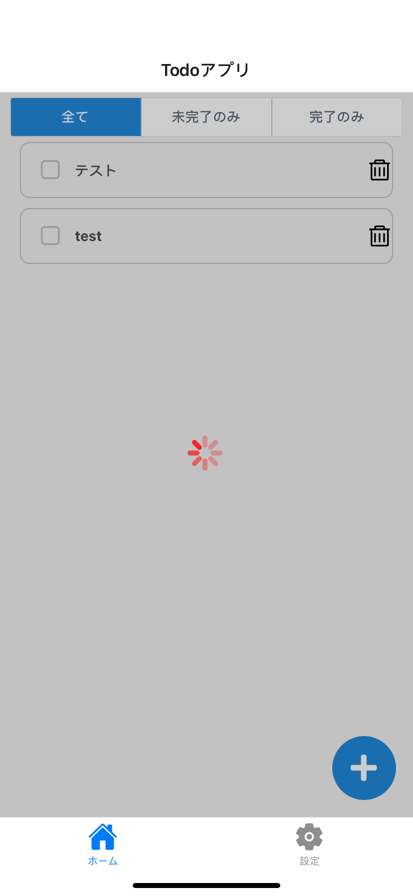

REST APIの呼びだしには少し時間がかかるものです。呼びだし中に何もフィードバックを返さないと、アプリで処理中なのか、自分の操作が伝わっていないのか、ユーザには判断できなくなってしまいます。そのため、REST APIの呼びだし中は、アプリが処理中であることをユーザに伝えるのが望ましいです。

また、削除したToDoの編集など、REST APIでの処理が完了するまでブロックしたい操作もあります。

ToDoアプリでは、REST APIの呼びだし中はToDo一覧上に、ローディング中であることを伝えるアクティビティインジケーターを表示します。また、ToDo一覧内での完了や編集などの操作をブロックします。

これから学習して実装して表現するローディング中状態は以下になります。



## REST APIの呼びだし状態の管理

まず、REST APIを呼びだすコンポーネントで、REST APIを呼びだし中かどうかを管理します。状態の管理には、Reactのステートを利用します。
処理中を`true`。処理済を`false`としてREST APIの呼びだし状態を管理するように修正します。

修正量が多いので、次のソースコードで`TodoBoard.tsx`を上書きしてください。

```typescript jsx title="/src/screens/todo/TodoBoard.tsx"
import {useFocusEffect} from '@react-navigation/native';
import {FilterType, TodoFilter, TodoList} from 'components/parts';
import {useTodoStackNavigation} from 'navigation/hooks';
import React, {useCallback, useContext, useState} from 'react';
import {Alert, StyleSheet, View} from 'react-native';
import {Icon, ThemeContext} from 'react-native-elements';
import {Todo, TodoService, ErrorObject} from 'services';

type ShowFilter = {
  [K in FilterType]: (todo: Todo) => boolean;
};

const showFilter: ShowFilter = {
  [FilterType.ALL]: () => true,
  [FilterType.INCOMPLETE]: (todo) => !todo.completed,
  [FilterType.COMPLETED]: (todo) => todo.completed,
};

export const TodoBoard: React.FC = () => {
  const {theme} = useContext(ThemeContext);
  const navigation = useTodoStackNavigation<'TodoBoard'>();
  const [todos, setTodos] = useState<Todo[]>();
  const [filterType, setFilterType] = useState<FilterType>(FilterType.ALL);
  const [loading, setLoading] = useState(false);

  useFocusEffect(
    useCallback(() => {
      let isActive = true;
      setLoading(true);

      TodoService.getTodos()
        .then((response) => {
          if (isActive) {
            setTodos(response);
          }
        })
        .catch((e: ErrorObject) => {
          console.log(e.message);
        })
        .finally(() => {
          if (isActive) {
            setLoading(false);
          }
        });

      return () => {
        isActive = false;
      };
    }, []),
  );

  const toggleTodoCompletion = useCallback(
    (id: number) => {
      if (todos === undefined) {
        return;
      }
      const target = todos.find((todo) => todo.id === id);
      if (!target) {
        return;
      }
      /*
       * Network越しの処理時間を待たずにUIを更新する。
       * 処理が正常に出来ない場合は戻すが、リソース（タスク）がなくなっている場合は削除する。
       */
      setTodos(todos.map((todo) => (todo.id === id ? {...todo, completed: !target.completed} : todo)));
      TodoService.putTodo(id, !target.completed).catch((e: ErrorObject) => {
        if (e.status && e.status === 404) {
          setTodos(todos.filter((todo) => todo.id !== id));
          console.log(`更新しようとしたタスクが存在しませんでした。`);
        } else {
          // errorで処理できなければ戻す
          setTodos(todos.map((todo) => (todo.id === id ? {...todo, completed: target.completed} : todo)));
          console.log(e.message);
        }
      });
    },
    [todos],
  );

  const showTodos = todos?.filter(showFilter[filterType]);

  return (
    <View style={styles.container} testID="screen/main/home">
      <TodoFilter filterType={filterType} setFilterType={setFilterType} />
      <TodoList
        todos={showTodos}
        contentContainerStyle={styles.todoListContainer}
        toggleTodoCompletion={toggleTodoCompletion}
      />
      <Icon
        name="plus"
        type="font-awesome-5"
        color={theme.colors?.primary}
        raised
        reverse
        size={30}
        containerStyle={styles.iconContainerStyle}
        onPress={() => {
          navigation.navigate('TodoForm');
        }}
      />
    </View>
  );
};

const styles = StyleSheet.create({
  container: {
    flex: 1,
  },
  todoListContainer: {
    paddingLeft: 20,
    paddingRight: 20,
    paddingBottom: 80,
  },
  iconContainerStyle: {
    position: 'absolute',
    bottom: 10,
    right: 10,
  },
  indicatorContainer: {
    position: 'absolute',
    zIndex: 2,
    width: '100%',
    flex: 1,
    alignContent: 'center',
    height: '100%',
    backgroundColor: 'rgba(0, 0, 0, 0.2)',
  },
  indicator: {
    flex: 1,
  },
});
```

:::caution
現時点では、エラー発生時の処理は実装しませんが、実装中にどのようなエラーが発生しているかを確認したいことは多いのでログ出力だけしています。

本来は、エラーが発生した場合にはユーザにもエラーの内容と（可能であれば）エラーから回復する方法を伝えるべきです。
:::

## アクティビティインジケータの表示

次に、REST APIを呼び出している間だけアクティビティインジケータを表示するように修正します。このとき、アクティビティインジケータを表示するコンポーネントをToDo一覧の上にかぶせて表示することで、ToDo一覧内でのユーザの操作をブロックします。

> 🚧 作成中 🚧

<!--
TODO: ステートを参照して、表示するかどうかを切り替えることと、下に配置すると上に表示されるから操作をブロックできることを伝えられれば良いだろうか。
-->

## 動作確認

これで、ToDo一覧取得のREST APIを呼びだしている間はアクティビティインジケータが表示され、一部の操作はブロックされるようになりました。実際にアプリを起動して動きを確認しましょう。

ただ、APIサーバをローカルホストで起動している場合などは、REST APIからの応答が早いため一瞬しかアクティビティインジケータが表示されません。この状態だとアクティビティインジケータの確認は難しいので、まずREST APIからの応答に時間がかかっている状況を擬似的に再現します。

> 🚧 作成中 🚧

<!--
TODO: ここでMiddlewareの話をして、APIクライアントからのレスポンスを遅延させるようにしてみる。
-->

このように修正すると、`TodoService`でToDo一覧などを取得するまでにxx秒かかるようになります。なので、その間アクティビティインジケータが表示され、xx秒経つとインジケータが消えることを確認しましょう。

> 🚧 作成中 🚧

<!--
TODO: 動作確認の手順を何パターンか提示しておくのがいいかな。「アプリ起動後」「タブ切替時」「ToDo登録後」くらいで充分かな？
-->
