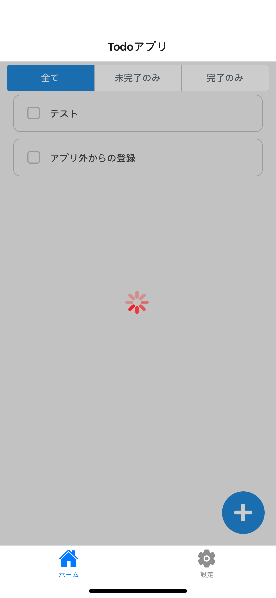

REST APIの呼びだすと応答を受け取るまでに少し時間がかかります。呼びだし中に何もフィードバックを返さないと、アプリで処理中なのか、自分の操作が伝わっていないのか、ユーザには判断できなくなってしまいます。
そのため、REST APIの呼びだしのような時間のかかる非同期処理は、アプリが処理中であることをユーザに伝えるのが望ましいです。

また、ToDo一覧が最新化されていないため、削除されているToDoを更新してしまうようなことを防ぐようなケースを想定すると、処理が完了するまでブロックしたい操作もあります。

ToDoアプリでは、一覧を取得中はToDo一覧上にローディング中であることを伝える[アクティビティインジケーター](https://reactnative.dev/docs/activityindicator)を表示しToDoの操作をブロックしましょう。

そのような機能を実現するためには処理中かどうかという状態を管理して、処理中の場合だけアクティビティインジケーターとブロックするためのViewを表示します。

下のイメージはアクティビティインジケーターを表示している画面です。


## REST APIの呼びだし状態の管理

まず、REST APIを呼びだすコンポーネントで、REST APIを呼びだし中かどうかの状態を管理します。

次のように `useState` を利用して`loading`状態を管理します。
REST APIを呼びだす`TodoService.getTodos()`の前で`loading`中に設定し、`finally`で`loading`を解除します。

```diff typescript title="screens/todo/TodoBoard.tsx"
export const TodoBoard: React.FC = () => {
   const {theme} = useContext(ThemeContext);
   const [todos, setTodos] = useState<Todo[]>([]);
   const [filterType, setFilterType] = useState<FilterType>(FilterType.ALL);
+  const [loading, setLoading] = useState(false);
 
   useFocusEffect(
     useCallback(() => {
       let isActive = true;

+      setLoading(true);
       TodoService.getTodos()
         .then((response) => {
           if (isActive) {
             setTodos(response);
           }
         })
-        .catch(() => {});
+        .catch((error) => {
+          console.log(error);
+        })
+        .finally(() => {
+          if (isActive) {
+            setLoading(false);
+          }
+        });

      return () => {
        isActive = false;
      };
    }, []),

```

`ToDo登録画面`でToDOの追加ボタンを押した後、応答前にヘッダーの`×ボタン`で閉じるとREST APIの処理完了を待たずに元の画面へ遷移してしまう為、
修正します。
ToDoの更新時、ToDo更新APIの応答前にUIを更新するよう`toggleTodoCompletion`へ追加する。
つづいてToDo登録でも同様の事象が発生するので、ToDo登録APIの応答後に`ToDo登録画面`がフォーカスされているかを判定し、
フォーカスされている場合、元画面へ戻るように修正します。

```diff typescript title="screens/todo/TodoBoard.tsx"
export const TodoBoard: React.FC = () => {

// 中略

    const toggleTodoCompletion = (id: number) => {
      const target = todos.find((todo) => todo.id === id);
      if (!target) {
        return;
      }
-      TodoService.putTodo(id, !target.completed)
-        .then((returnedTodo) => setTodos(todos.map((todo) => (todo.id === id ? returnedTodo : todo))))
-        .catch(() => {});
+      const updateTodo = {...target, completed: !target.completed};
+      setTodos(todos.map((todo) => (todo.id === id ? updateTodo : todo)));
+      TodoService.putTodo(id, !target.completed).catch(() => {});
    };

```

```diff typescript title="screens/todo/TodoForm.tsx"
export const TodoForm: React.FC = () => {
  const navigation = useNavigation();


  const onAdd = useCallback<(values: {task: string}) => void>(
    async ({task}) => {
      await TodoService.postTodo(task);
+      if (navigation.isFocused()) {
        navigation.goBack();
+      }
    },
    [navigation],
  );
```

:::caution
現時点では、エラー発生時の処理は実装しませんが、実装中にどのようなエラーが発生しているかを確認したいことは多いのでログ出力だけしています。

本来は、エラーが発生した場合にはユーザにもエラーの内容と（可能であれば）エラーから回復する方法を伝えるべきです。
:::

## 処理中UIの表示

次に、処理中であることを表示するように修正します。

処理中のUIはアクティビティインジケータを表示し、ViewコンポーネントをToDo一覧の上にかぶせて表示することで、ToDo一覧にあるToDoをユーザが操作できないようにします。
ただし、ToDo一覧の操作は出来ませんが、設定タブをタップして設定画面に遷移することは出来ます。

具体的には`loading`が`true`の時だけアクティビティインジケータを中央に表示し、操作できないように`View`でToDo一覧を覆います。

### 操作をブロックするためのスタイル定義

まず、操作をブロックするための`indicatorContainer`とアクティビティインジケーターを中央に表示するための`indicator`のスタイルを定義してください。

``` diff typescript jsx title="/src/screens/todo/TodoBoard.tsx"
const styles = StyleSheet.create({
  container: {
    flex: 1,
  },
  // 中略
  iconContainerStyle: {
    position: 'absolute',
    bottom: 10,
    right: 10,
  },
+  indicatorContainer: {
+    position: 'absolute',
+    zIndex: 2,
+    width: '100%',
+    flex: 1,
+    alignContent: 'center',
+    height: '100%',
+    backgroundColor: 'rgba(0, 0, 0, 0.2)',
+  },
+  indicator: {
+    flex: 1,
+  },
 });
```

### 処理中であることを伝えるUI

つぎにReactNativeの `ActivityIndicator` を表示します。
操作をブロックするためのContainerは、`loading` 中でなければ表示しない制御も入れます。

```diff typescript title="/src/screens/todo/TodoBoard.tsx"
 import React, {useCallback, useContext, useState} from 'react';
-import {Alert, StyleSheet, View} from 'react-native';
+import {Alert, StyleSheet, View, ActivityIndicator} from 'react-native';
 import {Icon, ThemeContext} from 'react-native-elements';

// 中略
       <Icon
         name="plus"
         type="font-awesome-5"
         color={theme.colors?.primary}
         raised
         reverse
         size={30}
         containerStyle={styles.iconContainerStyle}
         onPress={() => {
           navigation.navigate('TodoForm');
         }}
       />
+      {loading && (
+        <View style={styles.indicatorContainer}>
+          <ActivityIndicator color="red" style={styles.indicator} size="large" />
+        </View>
+      )}
     </View>
   );
```

:::note
`TodoService.getTodos()`の`finally`での`setLoaing(false)`をコメントアウトするとアクティビティインジケーターを確認出来ますが、コードを修正しないとToDo一覧を操作出来ません。
次の動作確認でREST APIの応答を一定時間待つという状態を擬似的に作り出してみましょう。
:::

### 動作確認

これで、ToDo一覧取得のREST APIを呼びだしている間はアクティビティインジケータが表示され、一部の操作はブロックされるようになりました。実際にアプリを起動して動きを確認しましょう。

ただ、APIサーバをローカルホストで起動している場合などは、REST APIからの応答が早いため一瞬しかアクティビティインジケータが表示されません。この状態だとアクティビティインジケータの確認は難しいので、まずREST APIからの応答に時間がかかっている状況を擬似的に再現します。

今回は、REST APIを呼び出したら応答までの時間を待つことを擬似的に再現してみましょう。
応答時間を待つ処理はREST APIではなくREST APIクライアントで実装します。

REST APIクライントの接続先を切り替えていた`config.ts`で`Middleware`というインタフェースを利用して機能を追加してみましょう。

Middlewareを利用して一定時間待機させるために、config.tsを次のように修正してください。
`${IP}` はご自身の環境に合わせて設定したままにしてください。

``` typescript jsx title="/src/backend/config.ts"
import {Configuration, Middleware} from './generated-rest-client';
const waitResponse: Middleware = {
  post: async (context) => {
    await new Promise((resolve) => setTimeout(resolve, 3000));
    return Promise.resolve(context.response);
  },
};
export const config = new Configuration({basePath: 'http://${IP}:9080/api', middleware: [waitResponse]});
```

:::note
ここではREST APIの応答後に`await`を利用して`Promise`が`resolve`するまで3秒間だけ待つように実装しています。
`await`について知りたい場合は事前学習で紹介しているJavaScript Primerの[非同期処理](https://jsprimer.net/basic/async/)にある[await 式](https://jsprimer.net/basic/async/#await-expression)を参照してみてください。
:::

ここまででREST APIを呼び出したら応答までの時間を擬似的に待つ設定が完了です。
実際に動作確認を進めていきます。次の手順で確認してください。

1. APIサーバを起動
2. アプリを起動
3. ログイン

ToDo一覧画面マウント時にToDo一覧取得APIの呼び出しをするので画面中央にアクティビティインジケーターが表示されることと操作がブロックされていることが確認できます。

次にToDo登録の確認を進めます。次の手順で確認してください。

1. APIサーバを起動
2. アプリを起動
3. ログイン
4. `＋`ボタン（ToDo登録）を押す
5. 登録するToDoを入力（ToDoはなんでも構いません）
6. `追加`ボタンを押す

さきほどの結果と同様で、ToDo一覧画面中央にアクティビティインジケーターが表示されることと操作がブロックされていることが確認できます。
また、6. の`追加`ボタンを押した直後にヘッダーの`×ボタン`を押してみてください。
ログに以下のメッセージが出力されていなければ正しく修正出来ていることが確認できます。

```console
the action GO_BACK was not handled by any navigator.
```
