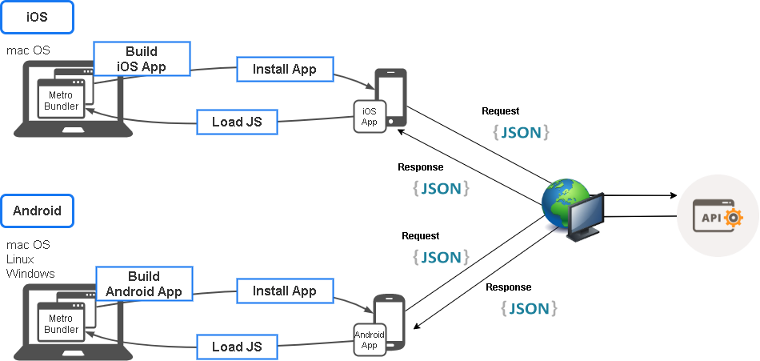
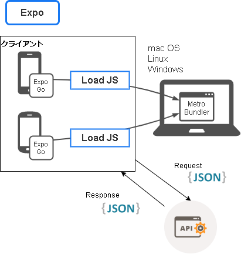

import Tabs from '@theme/Tabs';
import TabItem from '@theme/TabItem';

ここまでで、ToDoアプリの画面は一通り実装できました。ここからは、画面に表示するデータをREST APIから取得するように修正していきます。

## 開発時のネットワーク構成

ToDoアプリをAPIサーバと接続する場合、下の図にあるようなネットワーク構成で開発することになります。
ToDoアプリをAPIサーバと接続する場合の構成を説明します。まずは[アプリの実行](../../getting-started/launch-created-app.mdx#アプリ実行の仕組み)参照してここまでで作成した構成を確認しましょう。
次にこれから作成する構成を説明します。これからの学習で構築していく環境です。

<!-- textlint-disable ja-technical-writing/sentence-length,ja-technical-writing/max-comma,ja-spacing/ja-no-space-around-parentheses,jtf-style/3.3.かっこ類と隣接する文字の間のスペースの有無,ja-technical-writing/ja-no-mixed-period,ja-technical-writing/no-unmatched-pair -->

<Tabs
  defaultValue="rn-build"
  values={[
    {label: 'React Native', value: 'rn-build'},
    {label: 'Expo + React Native', value: 'expo-build'},
  ]}>

<!-- textlint-enable ja-technical-writing/sentence-length,ja-technical-writing/max-comma,ja-spacing/ja-no-space-around-parentheses,jtf-style/3.3.かっこ類と隣接する文字の間のスペースの有無,ja-technical-writing/ja-no-mixed-period,ja-technical-writing/no-unmatched-pair -->

<TabItem value="rn-build">

</TabItem>
<TabItem value="expo-build">

</TabItem>
</Tabs>

これまでとの大きな違いはREST APIとの通信が発生する部分です。
これからの学習でクライアントからREST APIへRequestを送信し、Responseをクライアントが受け取ったら画面へ出力する等を学習していきます。

## APIサーバの起動

では、React Nativeを開発している端末にAPIサーバを起動します。APIサーバはDockerを利用して起動する方法と、Mavenを利用して起動する方法があります。いずれかお好みの方法で起動してください。

> 🚧 作成中 🚧

<!--
TODO: Dockerで起動する方法、Maven(wrapper)で起動する方法のそれぞれを簡単に紹介する。多分、1行ずつくらいじゃないかな。
      起動中にエラーが出ないか（あるいは、正しく起動できているか）の確認はしておいたほうがいいんだっけ。
      Mavenの場合とDockerの場合で、APIサーバを落とした後にデータが保持されるかどうかが違うなら、それも説明しておきたい。
      もし保持されないなら、そう説明しておきたい。
-->

## APIサーバへの接続確認

Expo Goやテスト用のデバイスからAPIサーバにアクセスしようとしても、ファイアウォールなどに制限されてアクセスできない場合があります。

そのため初めに、ToDoアプリをインストールして実行するデバイスやシミュレータなどから、APIサーバにアクセスできるかどうかを確認しておきます。

デバイスやシミュレータでブラウザを起動し、APIサーバのURLにアクセスできることを確認してください。

> 🚧 作成中 🚧

<!--
TODO: 自端末のIPアドレスの調べ方(Windows/macOS)とかを紹介する必要があるかも
-->

このときアクセスするのに利用したIPアドレスは、後で設定ファイルに設定するので忘れないようにしてください。

これでAPIサーバの用意は完了です。次は、ToDoアプリで利用するREST APIのクライアントを作成します。
