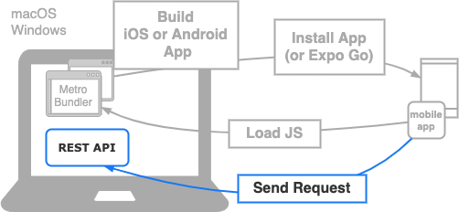

import Tabs from '@theme/Tabs';
import TabItem from '@theme/TabItem';

ここまでで、ToDoアプリの画面は一通り実装できました。ここからは、画面に表示するデータをREST APIから取得するように修正していきます。

## 開発時のネットワーク構成

ToDoアプリをAPIサーバと接続する場合、下の図にあるようなネットワーク構成で開発することになります。
構成の説明として、
いままでの構成とこれから準備する構成の違いがわかるよう色分けしています。

- グレー部分は画面の実装のときに用意し、確認していた部分です。アプリケーションを開発環境で動かすために必要な構成です。
- 背景色または、実線が青色になっている部分はこれから準備する部分を表しています。
  ここはアプリケーションが利用するので、アプリケーションに接続先を設定する必要がある箇所です。



これまでの構成との大きな違いはREST APIとの通信が発生する部分です。
次の学習でクライアントからREST APIへRequestを送信し、Responseをクライアントが受け取り、結果を画面出力する等を学習していきます。

## APIサーバの起動

ToDoアプリを開発している端末にAPIサーバを起動します。APIサーバはDockerを利用して起動する方法と、Mavenを利用して起動する方法があります。いずれかお好みの方法で起動してください。
[ハンズオン用 バックエンドサンプルアプリ](https://github.com/ws-4020/mobile-app-hands-on-backend#readme)にそれぞれの起動方法が記載されているので確認して実行してください。

## APIサーバへの接続確認

アプリを起動するデバイスからAPIサーバにアクセスしようとしても、ファイアウォールなどに制限されてアクセスできない場合があります。

そのため初めに、ToDoアプリをインストールして実行するデバイスやシミュレータなどから、APIサーバにアクセスできるかどうかを確認しておきます。

デバイスやシミュレータでブラウザを起動し、APIサーバのURLにアクセスできることを確認してください。

:::caution
アクセス前にAPIサーバを起動しておいてください。
:::

URLには確認時に使用する端末のIPアドレスが必要となります。それぞれの環境で以下のコマンドを実行してIPアドレスを確認してください。

<!-- textlint-disable ja-technical-writing/sentence-length,ja-technical-writing/max-comma,ja-spacing/ja-no-space-around-parentheses,jtf-style/3.3.かっこ類と隣接する文字の間のスペースの有無,ja-technical-writing/ja-no-mixed-period,ja-technical-writing/no-unmatched-pair -->

<Tabs
  groupId="operating-systems"
  defaultValue="win"
  values={[
    {label: 'macOS', value: 'mac'},
    {label: 'Windows', value: 'win'},
  ]
}>

<!-- textlint-enable ja-technical-writing/sentence-length,ja-technical-writing/max-comma,ja-spacing/ja-no-space-around-parentheses,jtf-style/3.3.かっこ類と隣接する文字の間のスペースの有無,ja-technical-writing/ja-no-mixed-period,ja-technical-writing/no-unmatched-pair -->

<TabItem value="mac">

```bash
ipconfig getifaddr en0
```

</TabItem>
<TabItem value="win">

```bash
ipconfig
```

</TabItem>
</Tabs>

アクセス先端末のIPアドレスが確認出来たので、ブラウザを利用して実際にアクセスしてみましょう。
アクセス先のURLとレスポンスの期待値は以下となります。

### アクセス先URL

`${IP}`部分を確認したIPアドレスへ変更して[REST API](../app-spec.md#rest-api)のToDoの一覧取得APIにアクセスしてください。

```console
http://${IP}:9080/api/todos
```

### レスポンス結果の期待値

ブラウザにレスポンスのJSONが表示されます。
データを登録していない場合、空配列のJSONがレスポンスとなります。

```console
[]
```

このときアクセスするのに利用したIPアドレスは、後で設定ファイルに設定するので忘れないようにしてください。

これでAPIサーバの用意は完了です。次は、ToDoアプリで利用するREST APIのクライアントを作成します。
