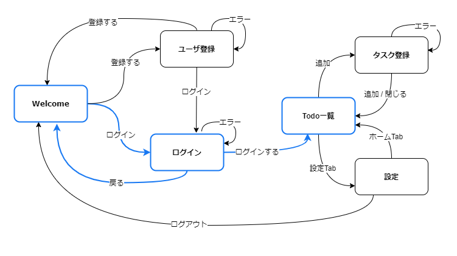

各画面を実装する前に、全体の画面遷移を実装していきましょう。
まずは、Welcome画面からToDo一覧までの画面遷移をStackナビゲーションで実装します。



## 画面を追加

ログイン画面とToDo一覧画面を追加します。中身は後で実装するため、ひな型を実装します。

次のファイルを追加・修正してください。

- `/src/screens/auth/Login.tsx`
- `/src/screens/auth/index.ts`
- `/src/screens/todo/TodoBoard.tsx`
- `/src/screens/todo/index.ts`
- `/src/screens/index.ts`

```typescript jsx title="/src/screens/auth/Login.tsx"
import React from 'react';
import {StyleSheet, View} from 'react-native';

export const Login: React.FC = () => {
  return (
    <View style={styles.container}>{/* Todo*/}</View>
  );
};

const styles = StyleSheet.create({
  container: {
    flex: 1,
  },
});
```

```typescript jsx title="/src/screens/auth/index.ts"
export * from './Login';
```

```typescript jsx title="/src/screens/todo/TodoBoard.tsx"
import React from 'react';
import {StyleSheet, View} from 'react-native';

export const TodoBoard: React.FC = () => {
  return (
    <View style={styles.container}>{/* Todo*/}</View>
  );
};

const styles = StyleSheet.create({
  container: {
    flex: 1,
  },
});
```

```typescript jsx title="/src/screens/todo/index.ts"
export * from './TodoBoard';
```

``` diff jsx title="/src/screens/index.ts"
+ export * from './auth';
  export * from './home';
  export * from './instructions';
+ export * from './todo';
```

## Stackナビゲーション

追加した画面を`RootStackNav`ナビゲータに追加します。`src/navigation/RootStackNav.tsx`を修正してください。

``` diff jsx title="src/navigation/RootStackNav.tsx"
  import {createStackNavigator} from '@react-navigation/stack';
  import React from 'react';
- import {Welcome, Instructions} from 'screens';
+ import {Welcome, Instructions, Login, TodoBoard} from 'screens';

  const nav = createStackNavigator();
  export const RootStackNav: React.FC = () => {
    return (
      <nav.Navigator initialRouteName={Welcome.name}>
        <nav.Screen name="Welcome" component={Welcome} options={{headerShown: false}} />
        <nav.Screen name="Instructions" component={Instructions} />
+       <nav.Screen name="Login" component={Login} />
+       <nav.Screen name="TodoBoard" component={TodoBoard} />
      </nav.Navigator>
    );
  };
```

### ヘッダーのカスタマイズ

次に、Welcome画面からログイン画面へ遷移できるようにします。[To Doアプリの仕様](./app-spec.md)のWelcome画面のように、ログインボタンを追加しましょう。
Stackナビゲーションではオプションを指定することでヘッダーをカスタマイズできます。

修正量が多いので、次のソースコードで`RootStackNav.tsx`を上書きしてください。

```typescript jsx title="src/navigation/RootStackNav.tsx"
import {useNavigation} from '@react-navigation/native';
import {createStackNavigator} from '@react-navigation/stack';
import React from 'react';
import {Button} from 'react-native-elements';
import {Welcome, Instructions, Login, TodoBoard} from 'screens';

const HeaderRight: React.FC = () => {
  const navigation = useNavigation();
  return <Button type="clear" onPress={() => navigation.navigate('Login')} title="ログイン" />;
};

const nav = createStackNavigator();
export const RootStackNav: React.FC = () => {
  return (
    <nav.Navigator
      initialRouteName={Welcome.name}
      screenOptions={{
        headerRight: () => <HeaderRight />
      }}
    >
      <nav.Screen
        name="Welcome"
        component={Welcome}
        options={{
          headerTitle: 'Welcome',
        }}
      />
      <nav.Screen
        name="Login"
        component={Login}
        options={{
          headerTitle: 'ログイン',
          headerRight: undefined,
        }}
      />
      <nav.Screen
        name="TodoBoard"
        component={TodoBoard}
        options={{
          headerTitle: 'Todo一覧',
        }}
      />
      <nav.Screen name="Instructions" component={Instructions} />
    </nav.Navigator>
  );
};
```

:::info
共通定義は`Navigator`の`screenOptions`に、画面ごとの定義は`Screen`の`options`に定義します。
今回はログインボタンを共通定義として、ログイン画面のみ表示しないよう設定しました。
指定できるオプションの種類については[公式ドキュメントのAPI定義](https://reactnavigation.org/docs/stack-navigator#options)を参照してください。
:::

Welcome画面にヘッダーが表示されて、ログインボタンからログイン画面に遷移できたら成功です。
ログイン画面からWelcome画面に戻れることも確認してください。

最後に、ログイン画面からToDo一覧画面への遷移を実装します。`src/screens/auth/Login.tsx`を修正してください。

``` diff jsx title="/src/screens/auth/Login.tsx"
+ import {useNavigation} from '@react-navigation/native';
  import React from 'react';
  import {StyleSheet, View} from 'react-native';
+ import {Button} from 'react-native-elements';

  export const Login: React.FC = () => {
    return (
-     <View style={styles.container}>{/* Todo*/}</View>
+     <View style={styles.container}>
+       <Button onPress={() => navigation.navigate('TodoBoard')} title="ログイン" />
+     </View>
    );
  };

  const styles = StyleSheet.create({
    container: {
      flex: 1,
    },
  });
```

ログイン画面にログインボタンが表示され、タップしてToDo一覧に遷移できたら成功です。
