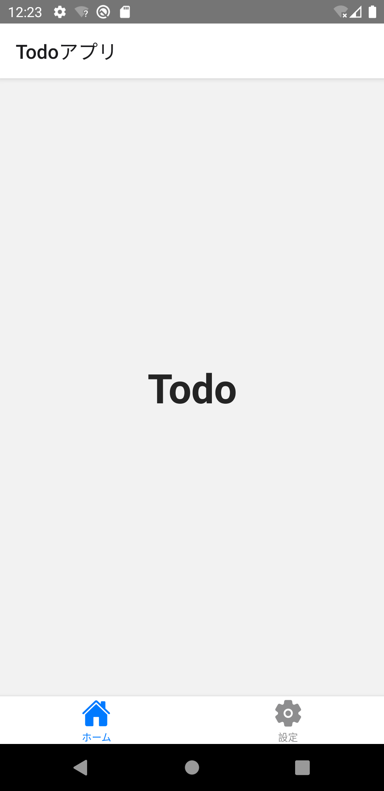

ToDo一覧画面と設定画面のタブ切替を実装していきます。タブ切替はTabナビゲーションで実装します。

## 画面追加

まずは、設定画面を追加します。中身は後で実装するため、ひな型を実装します。

次のファイルを追加・修正してください。

- `/src/screens/settings/UserSetting.tsx`
- `/src/screens/settings/index.ts`
- `/src/screens/index.ts`

```typescript jsx title="/src/screens/settings/UserSetting.tsx"
import React from 'react';
import {StyleSheet, View} from 'react-native';

export const UserSetting: React.FC = () => {
  return (
    <View style={styles.container}>{/* Todo*/}</View>
  );
};

const styles = StyleSheet.create({
  container: {
    flex: 1,
  },
});
```

```typescript jsx title="/src/screens/settings/index.ts"
export * from './UserSetting';
```

```diff title="/src/screens/index.ts"
  export * from './auth';
  export * from './home';
  export * from './instructions';
+ export * from './settings';
  export * from './todo';
```

## Tabナビゲーション

先ほど追加した画面をタブ切替できるようにナビゲータ構成を修正します。修正手順は次の通りです。

1. ToDo一覧画面と設定画面をそれぞれ配置するStackナビゲータ（`TodoStackNav`と`SettingsStackNav`）を追加
1. Stackナビゲータを切り替えるTabナビゲータ（`MainTabNav`）を追加
1. `RootStackNav`ナビゲータに`Main`という名前でTabナビゲータ（`MainTabNav`）を配置


:::info
Tabナビゲーターに画面（`TodoBoard`や`UserSetting`）を直接設定せずにStackナビゲーターを設定することで、ひとつのタブ内に複数の画面を表示できます。
:::

まず、ToDo一覧画面と設定画面をそれぞれ配置するStackナビゲータ（`TodoStackNav`と`SettingsStackNav`）を追加します。
その後、それらを切り替えるTabナビゲータ（`MainTabNav`）を追加します。
次のファイルを追加・修正してください。

- `/src/navigation/TodoStackNav.tsx`
- `/src/navigation/SettingsStackNav.tsx`
- `/src/navigation/MainTabNav.tsx`
- `/src/navigation/index.ts`

```typescript jsx title="/src/navigation/TodoStackNav.tsx"
import {createStackNavigator} from '@react-navigation/stack';
import React from 'react';
import {TodoBoard} from 'screens';

const nav = createStackNavigator();
export const TodoStackNav: React.FC = () => (
  <nav.Navigator initialRouteName="TodoBoard">
    <nav.Screen
      name="TodoBoard"
      component={TodoBoard}
      options={{
        headerTitle: 'Todoアプリ',
      }}
    />
  </nav.Navigator>
);
```

```typescript jsx title="/src/navigation/SettingsStackNav.tsx"
import {createStackNavigator} from '@react-navigation/stack';
import React from 'react';
import {UserSetting} from 'screens';

const nav = createStackNavigator();
export const SettingsStackNav: React.FC = () => (
  <nav.Navigator screenOptions={{headerShown: false}} initialRouteName="UserSetting">
    <nav.Screen name="UserSetting" component={UserSetting} />
  </nav.Navigator>
);
```

```typescript jsx title="/src/navigation/MainTabNav.tsx"
import {Ionicons} from '@expo/vector-icons';
import {createBottomTabNavigator} from '@react-navigation/bottom-tabs';
import React from 'react';

import {SettingsStackNav} from './SettingsStackNav';
import {TodoStackNav} from './TodoStackNav';

const nav = createBottomTabNavigator();
export const MainTabNav: React.FC = () => {
  return (
    <nav.Navigator initialRouteName="Todo">
      <nav.Screen
        name="Todo"
        component={TodoStackNav}
        options={{
          title: 'ホーム',
          tabBarIcon: ({color}) => <Ionicons name="md-home" size={30} color={color} />,
        }}
      />
      <nav.Screen
        name="Settings"
        component={SettingsStackNav}
        options={{
          title: '設定',
          tabBarIcon: ({color}) => <Ionicons name="md-settings" size={30} color={color} />,
        }}
      />
    </nav.Navigator>
  );
};
```

``` diff jsx title="/src/navigation/index.ts"
  export * from './RootStackNav';
  export * from './UnauthedStackNav';
  export * from './AuthedRootStackNav';
+ export * from './MainTabNav';
+ export * from './TodoStackNav';
+ export * from './SettingsStackNav';
```

`RootStackNav`ナビゲータに`Main`という名前でTabナビゲータ（`MainTabNav`）を配置します。

次のファイルを修正してください。

- `/src/navigation/RootStackNav.tsx`

``` diff jsx title="/src/navigation/RootStackNav.tsx"
  import {useNavigation} from '@react-navigation/native';
  import {createStackNavigator} from '@react-navigation/stack';
  import React from 'react';
  import {Button} from 'react-native-elements';
- import {Welcome, Instructions, Login, TodoBoard} from 'screens';
+ import {Welcome, Instructions, Login} from 'screens';

+ import {MainTabNav} from 'navigation/MainTabNav';

  const HeaderRight: React.FC = () => {
    const navigation = useNavigation();
    return <Button type="clear" onPress={() => navigation.navigate('Login')} title="ログイン" />;
  };

  const nav = createStackNavigator();
  export const RootStackNav: React.FC = () => {
    return (
      <nav.Navigator
        initialRouteName={Welcome.name}
        screenOptions={{
          headerRight: () => <HeaderRight />
        }}
      >
        <nav.Screen
          name="Welcome"
          component={Welcome}
          options={{
            headerTitle: 'Welcome',
          }}
        />
        <nav.Screen
          name="Login"
          component={Login}
          options={{
            headerTitle: 'ログイン',
            headerRight: undefined,
          }}
        />
        <nav.Screen
-         name="TodoBoard"
-         component={TodoBoard}
+         name="Main"
+         component={MainTabNav}
          options={{
-           headerTitle: 'Todo一覧',
+           headerShown: false,
          }}
        />
        <nav.Screen name="Instructions" component={Instructions} />
      </nav.Navigator>
    );
  };
```

修正できたら実行してください。ToDo一覧画面と設定画面のタブ切替ができたら成功です。


