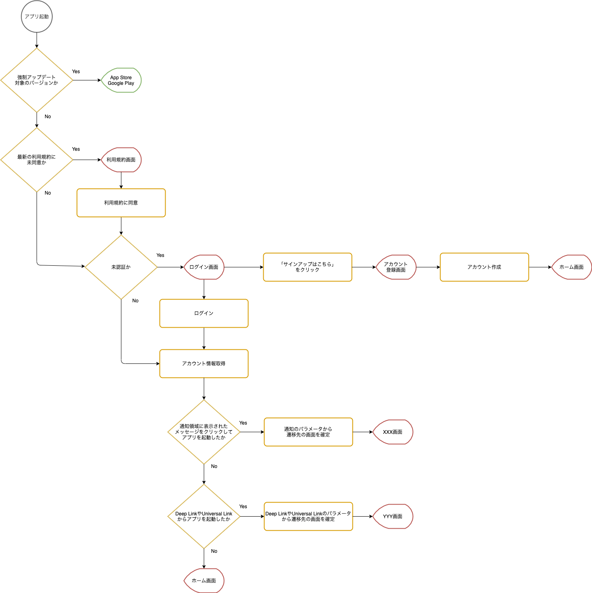

SantokuAppでは、アプリ起動後にスプラッシュ画面を表示してアプリの初期処理を実施します。初期化処理の実施内容は以下になります。

- 起動したアプリのバージョンが、強制アップデートの対象かどうかを確認
- 利用規約に同意済かどうかを確認
- 認証状態の確認
- アプリの起動方法の確認
  - アプリアイコンをクリックして起動
  - 通知領域に表示されたPush通知からのメッセージをクリックして起動
  - Deep LinkやUniversal Linkからの起動

初期化処理の実施結果に応じて、スプラッシュ画面から遷移する画面を決めます。

---

以下はメモ

* 初期化処理はStackナビゲーションを別にする
* アプリケーション起動後に必ず最初に呼ばれる
  * アプリケーションを再起動時も呼ばれる
* 初期化処理では、↓を実施
  * アプリケーション強制アップデートバージョン取得処理
  * 利用規約の同意取得処理
  * 認証状態取得処理
* 初期化処理から普通のスタックに移動するときは、initialRootName？を渡す
