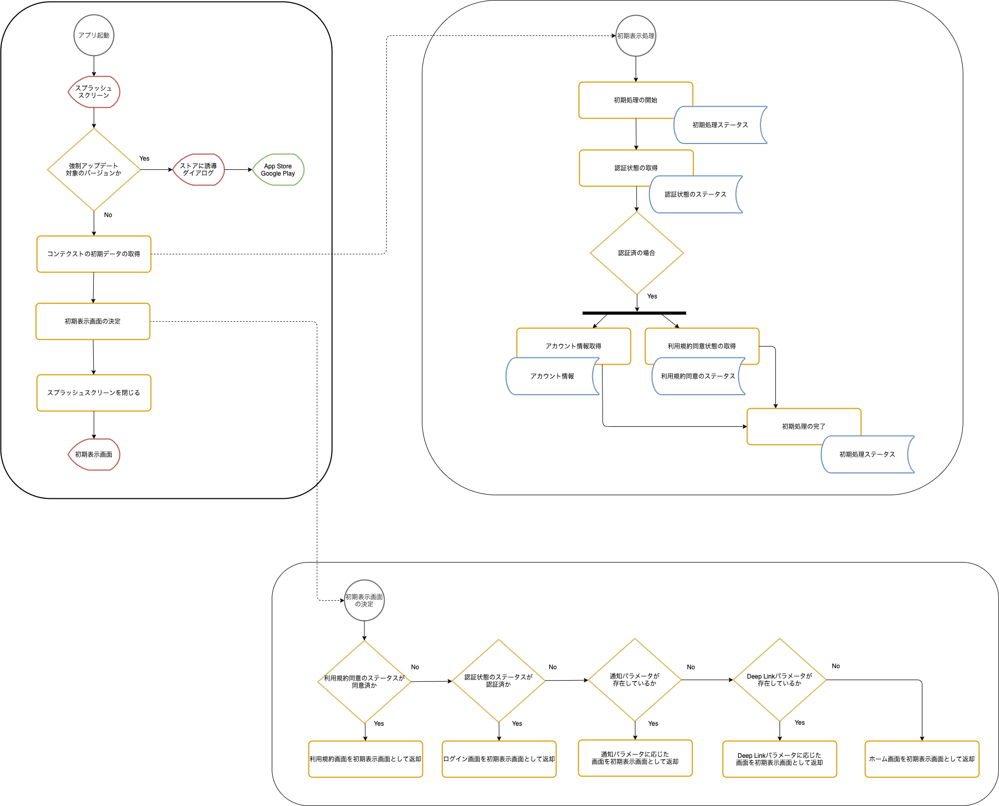
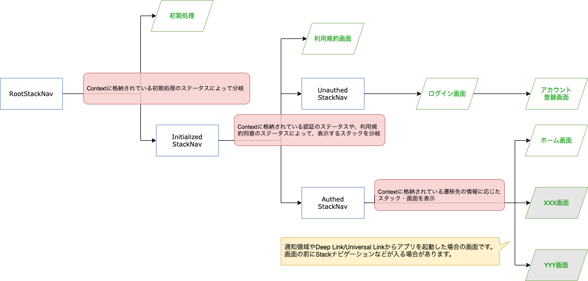

SantokuAppでは、アプリ起動後にスプラッシュスクリーンを表示してアプリの初期処理を実施します。初期処理は、アプリ起動後に確認しなければいけない事項のチェックや、アプリ全体で共有する情報を取得します。また、初期処理の結果に応じてスプラッシュスクリーンから遷移する画面を決定します。

| 初期処理        |      概要      |
| ------------- | ------------- |
| 強制アップデート対象のバージョン確認      | 起動したアプリのバージョンが強制アップデートの対象かを確認します。対象の場合は、App Store、Google Playに誘導します。 |
| 利用規約同意状態の取得 | 最新の利用規約に同意済みであるかを取得します。同意してない場合は、利用規約画面を表示します。 |
| 認証状態の取得 | セキュアストレージに有効なリフレッシュトークンが存在するかを確認します。存在しない場合は、ログイン画面を表示します。認証状態の確認に関する詳細は、XXXを参照してください。 |
| 通知のパラメータを取得 | 通知領域に表示されたメッセージをクリックしてアプリ起動した場合は、通知パラメータを取得します。Push通知に含まれるデータの内容に応じて遷移先を決めます。 |
| Deep Linkのパラメータを取得 | Deep Linkから起動した場合は、Deep Linkに含まれるパラメータを取得します。Deep Linkのパラメータに応じて遷移先を決めます。 |
| アカウント情報の取得 | アカウント情報を取得して、アプリのどこからでも参照できるようにします。 |

> 🚧 作成中 🚧
<!--
TODO: Push通知とか、Deep Link/Universal Linkの場合、事前にアカウント情報以外にも取得すべき情報があるかも
-->

## 初期処理の結果に応じた画面の切り替え

アプリの初期処理の結果に応じた画面の切り替えは、以下の方法で実現します。

- 初期処理実施中に表示するStackナビゲータと、初期処理実施後に表示するStackナビゲータを分ける
- 認証済みの場合に表示するStackナビゲータと、未認証の場合に表示するStackナビゲータを分ける
- 初期処理の結果として、以下の情報をContext（仮）に設定する
  - 初期処理のステータス（初期処理が完了したか、そうではないか）
  - 認証のステータス（認証済みか、そうではないか）
  - 遷移先のStackナビゲータ名
  - 遷移先の画面名

> 🚧 作成中 🚧
<!--
TODO: スタックナビゲーションを飛ばした場合ってどうなるのかな？(親子関係が、StackA - StackB - StackCの場合に、StackAからStackCに飛ぶ場合)
      値を共有する方法（ステートの管理）が未決定
      認証のステータスが他にもありそう
      遷移先を`initialRouteName`で指定するのって大丈夫かな？Stackを空にした場合とかに、Contextに入ってる`initialRouteName`を表示していいのか怪しい気もする。
      ここではなく、他の項？とかに持っていくことを検討
      利用規約画面はモーダル画面で表示したほうが良いかも
-->

## アプリの起動方法を確認する方法

> 🚧 作成中 🚧
<!--
TODO: ここではなく、他の項？とかに持っていくことを検討
-->

SantokuAppでは、アプリの起動方法として以下の3パターンを想定しています。

- アプリアイコンをタップして起動
- 通知領域に表示されたメッセージをタップして起動
- Deep LinkやUniversal Linkから起動

### アプリアイコンをタップして起動した場合の検知方法

「アプリアイコンをタップして起動」の場合は、アプリで検知することはできません。「通知領域に表示されたメッセージをクリックして起動」の場合と、「Deep LinkやUniversal Linkから起動」の場合以外は、「アプリアイコンをクリックして起動」したとみなします。

### 通知領域に表示されたメッセージをクリックして起動した場合の検知方法

> 🚧 作成中 🚧
<!--
TODO: コード例をベースに記載
-->

### Deep LinkやUniversal Linkから起動した場合の検知方法

> 🚧 作成中 🚧
<!--
TODO: コード例をベースに記載
-->
