## 概要

認証とは、何らかの手段によって対象の真正性を確認する行為です。
このガイドにおける認証対象は人間であり、相手認証（本人認証）を指します。
認証は主に次のいずれかの方法で行われます。

- 知っている：パスワードやPINなど、所有者だけが知っている情報を用いた認証
- 所有している：メールアドレスやトークンなど、所有者だけが持っているものを用いた認証
- 特徴がある：本人固有の身体情報を用いた認証

### システム構成の変化に伴う認証方式の変化

認証方式は、システム構成の変化と共に変わってきました。
2000年頃では、Web技術の発展と普及に伴い、次に示す利点からWebアプリケーションは支持されました。

- 更新が容易
- クライアント側に特別なアプリケーションが不要（標準ブラウザのみで動作する）
- 広範囲にサービスを提供出来る

当時のWebアプリケーションは、ID/パスワードによる認証が主流でした。
認証基盤は各アプリケーション毎に実装し、管理されていました。
Webアプリケーションのシステム構成図を次に示します。

業務の効率化やサービスの拡大に伴い、様々なWebアプリケーションが構築されました。
その結果、次に示すユーザーの利便性やセキュリティ課題が問題視されました。

- ID/パスワード管理の煩雑さ
- アプリケーション毎のログイン操作
- パスワード管理の不備
- 認証強度の低さ（一要素のみの認証）

そこで、各アプリケーション毎に認証基盤を用意するのではなく、認証サービス（アイデンティティ・プロバイダ）と連携するシステム構成へと変化しました。

また、モバイル端末の普及やSPA技術の台頭により、ユーザインタフェース部分はクライアントサイドで提供し、サーバーサイドはサービスのみを提供するシステム構成が現在の主流となりつつあります。

:::note
本ガイドでは、上記システム構成のアプリケーションをWebアプリケーションと対比してサービスアプリケーションと呼称します。
:::

### 認証方式に関する疑問や課題

このようなシステム構成の変化に伴い、次に示すような認証方式に関する疑問や課題が生じております。

- ユーザインタフェース部分がクライアントサイドに分離したが、ログイン処理の起点もクライアントサイドになるのか。この場合、認証サービスとの連携はどのように実現すればいいのか。例えば、WebアプリケーションでOpenID Connect認証を用いる場合、（Webブラウザのリダイレクト機能を駆使した）認可コードフローが推奨されているが、サービスアプリケーションの場合はどうするのがベストか
- バックエンドサービスへのアクセスは従来のセッションベースからトークンベースに変更したほうがいいのか。その場合、トークンはアクセストークン、IDトークンのどちらを使えばいいのか
- トークンの有効期限はどれくらいが望ましいのか
- 既存システム独自のアクセス制御を既に実装している。アクセストークンは許可の役割を持っているので、アプリケーションもそれを使うよう改修しないといけないのか
- 既存システムの資産を活かしてクライアントサイドのみを再構築したいが、セッションベースからトークンベースへ変更しないといけないのか。その場合、回収コストが大きい
- モバイルアプリケーションを起動する度に、毎回ID／パスワードを入力させないようにするにはどうすればいいのか
- モバイルアプリケーション起動時の毎回の認証操作を不要とした場合、モバイル端末の紛失や盗難リスクにどう対処すればいいのか

### 本ガイドで紹介する認証方式について

本ガイドで紹介する認証方式は、これらの疑問や課題に対する１つの解決手法です。
以下、その認証方式について紹介します。

## 認証方式

今回紹介する認証方式の特徴は次の通りです。

- [RFC 8252](https://www.rfc-editor.org/rfc/rfc8252.txt)に従ったネイティブアプリケーションによるOIDC認証
- IDトークンによるバックエンドサービスとのセッション確立
- トークン永続化による認証の継続と端末認証による保護

### RFC 8252に従ったネイティブアプリケーションによるOIDC認証

[OpenID Connectにおける認証フロー](./stateless-authn.md#openid-connectにおける認証フロー)で紹介しているように、[RFC 8252](https://www.rfc-editor.org/rfc/rfc8252.txt)ではネイティブアプリケーションのBest Current Practiceを定義しています。こちらに従うことで、安全にネイティブアプリケーションによるOIDC認証を実現します。

### IDトークンによるバックエンドサービスとのセッション確立

OIDC認証で得たIDトークンを用いてバックエンドサービスとのセッションを確立します。
アクセストークンとは違い、IDトークンはリライング・パーティに対して解析されることを意図されたものです。
フロントエンドとバックエンドサービスが同一リライング・パーティ内にある状況において、IDトークンを共有することは問題ありません。
IDトークンはアクセストークンと異なり認証の証明とでき、そのフォーマットも仕様で定められています。
このIDトークンをバックエンドサービスに（従来のID/パスワードの代わりに）提示し、IDトークンの妥当性を検証することで、バックエンドサービスとのセッションを確立します。
IDトークンはバックエンドサービスとの認証時のみに使用するため、有効期限は充分に短くすることを想定しております（通常数分以内）。

OpenID Connectによる認証とIDトークンによるバックエンドサービスとのセッション確立の認証シーケンスを次に示します。

### トークン永続化による認証の継続と端末認証による保護

### 本認証方式の優位性

### 認証フロー

## 実装コードの説明

