## 認証方式

今回紹介する認証方式は、[認証方式に関する疑問や課題](overview#認証方式に関する疑問や課題)に対する1つの解決手法です。
この認証方式の特徴は次の通りです。

- [RFC 8252](https://www.rfc-editor.org/rfc/rfc8252.txt)に従ったOpenID Connect認証
- IDトークンによるバックエンドサービスとのセッション確立
- トークン保管による認証の継続と端末認証による保護

認証方式のアーキテクチャ図を次に示します。

### RFC 8252に従ったOpenID Connect認証

[OpenID Connectにおける認証フロー](./stateless-authn.md#openid-connectにおける認証フロー)の紹介にあるとおり、[RFC 8252](https://www.rfc-editor.org/rfc/rfc8252.txt)ではネイティブアプリケーションのBest Current Practiceを定義しています。
これに従うことで、充分に検証された手法で認証出来ます。

### IDトークンによるバックエンドサービスとのセッション確立

認証で得たIDトークンを用いて、バックエンドサービスとのセッションを確立します。
IDトークンはリライング・パーティによる解析を意図されたものです。
フロントエンドとバックエンドサービスが同一リライング・パーティ内にある前提において、IDトークンを共有することは問題ありません。
アクセストークンとは違い、IDトークンは認証の証明に使用でき、そのフォーマットも仕様で定められています。
このIDトークンをHTTPSを使用してバックエンドサービスに（従来のID/パスワードの代わりに）送信し、IDトークンの妥当性を検証することでバックエンドサービスとのセッションを確立します。
IDトークンはバックエンドサービスとの認証のみに使用するため、有効期限は充分に短くすることが出来ます（通常数分以内）。

:::info
IDトークンの妥当性検証については、[Amazon CognitoのIDトークンを利用したREST APIの認証例](https://fintan.jp)に詳細な記載があります。
:::

:::caution
IDトークンは（リライング・パーティ内でない）他システムとの連携で用いるのは不適切です。
他システム連携によるアクセス制御は別の方式を採用してください。
:::

OpenID Connect認証と組合わせた認証シーケンスを次に示します。

### トークン保管による認証の継続と端末認証による保護

認証で得たリフレッシュトークンをログイン資格情報として保管することで、ログイン操作なしの認証を実現します。

:::note
ログイン資格情報の保管については、[ログイン資格情報の管理](./manage-credentials)に詳細な記載があります。
:::

ログイン操作なしの認証によりユーザの利便性はあがります。一方で、モバイル端末紛失や盗難時のリスクが生じます。
そこで、保管されたリフレッシュトークンを利用する場合、端末認証による許可を求めます。
そうすることで、端末所持者のみにログイン操作なしの認証を許可します。

保管されたトークンと端末認証を利用した認証シーケンスを次に示します。

### 認証フロー

本認証方式をまとめたフローチャートを次に示します。

### 認証方式の優位性

この認証方式の優位性は次の通りです。

- [RFC 8252](https://www.rfc-editor.org/rfc/rfc8252.txt)に従うことで、認証方式の安全性を担保できる。また、[RFC 8252](https://www.rfc-editor.org/rfc/rfc8252.txt)を実装したSDK（[AppAuth](https://appauth.io/)）を用いることで品質と生産性向上を期待できる
- 少ないコストで既存システムの認証方式を改修でき、ソフトウェア資産を流用できる
- 端末認証と組合わせることで、リスクに対処しながら利便性を向上できる
