## 概要

認証とは、何らかの手段によって対象の真正性を確認する行為です。
このガイドにおける認証対象は人間であり、本人認証を指します。
認証は、主に次のいずれかの内容で確認されます。

- 知っている：パスワードやPINなど、本人だけが知っている情報
- 所有している：メールアドレスやトークンなど、本人だけが所持しているもの
- 特徴がある：本人固有の身体情報

### 認証方式の変遷

認証方式は、システム構成やセキュリティに対する意識の変化と共に変わってきました。

2000年頃では、Web技術の発展と普及に伴い、次に示す利点からWebアプリケーションが採用されました。

- クライアント側に特別なアプリケーションが不要（標準ブラウザのみで動作する）
- 更新が容易
- 広範囲へのサービス提供が可能

当時のWebアプリケーションは、ID/パスワードによる認証方式が主流でした。
認証基盤は各アプリケーション毎に実装され、管理されていました。
一般的なWebアプリケーションのシステム構成図を次に示します。

業務の効率化やサービス拡大を背景に、様々なWebアプリケーションが構築されました。
その結果、ユーザの利便性やセキュリティ課題が生じました。

- アプリケーション毎にID/パスワードが異なるため、ユーザとサービス提供者双方の管理コストが大きい
- アプリケーション毎にログイン操作が必要。利便性に欠ける
- 一要素のみの認証。認証強度が低い

そこで、各アプリケーション毎に認証基盤を用意するのではなく、認証サービス（アイデンティティ・プロバイダ）を利用したシステム構成が採用され始めました。
また、モバイル端末の普及や（操作性向上を目的とした）SPA技術の台頭もシステム構成に大きな変化を与えました。
ユーザインタフェース部分はクライアントサイドで提供し、バックエンドはサービスのみを提供するシステム構成が昨今の主流となりつつあります。

:::note
本ガイドでは、上記システム構成のアプリケーションを（Webアプリケーションと対比して）サービスアプリケーションと呼称します。
:::

### 認証方式に関する疑問や課題

認証方式の変遷に伴い、次に示す疑問や課題があります。

- ユーザインタフェース部分がクライアントサイドに分離したが、ログイン処理の起点もクライアントサイドになるのか。この場合、認証サービスとの連携はどう実現するのがベストか。例えば、WebアプリケーションでOpenID Connect認証を用いる場合、（Webブラウザのリダイレクト機能を駆使した）認可コードフローが推奨されている。サービスアプリケーションの場合はどうするのか
- バックエンドサービスがAPIを提供するために、従来のセッションベースからトークンベースに変更しないといけないのか
- トークンはアクセストークン、IDトークンのどちらを使えばいいのか
- トークンの有効期限はどれくらいが望ましいのか
- 既存システムでは独自のアクセス制御を実装している。アクセストークンは許可の役割を持っているが、それを使うよう改修したほうがいいのか
- クライアントサイドのみ再構築したいが、認証基盤を変更する場合は改修コストが大きい
- （モバイルアプリケーションらしく）起動毎のログイン操作（ID/パスワードの入力を指す）なしに認証したい。どう実現すればいいか
- 毎回のログイン操作を不要とした場合、モバイル端末紛失や盗難時のリスクにどう対処すればいいか

### 本ガイドで紹介する認証方式について

本ガイドで紹介する認証方式は、これらの疑問や課題に対する1つの解決手法です。
次の節以降で認証方式について紹介します。

## 認証方式

今回紹介する認証方式の特徴は次の通りです。

- [RFC 8252](https://www.rfc-editor.org/rfc/rfc8252.txt)に従ったOpenID Connect認証
- IDトークンによるバックエンドサービスとのセッション確立
- トークン保管による認証の継続と端末認証による保護

認証方式のアーキテクチャ図を次に示します。

### RFC 8252に従ったOpenID Connect認証

[OpenID Connectにおける認証フロー](./stateless-authn.md#openid-connectにおける認証フロー)の紹介にあるとおり、[RFC 8252](https://www.rfc-editor.org/rfc/rfc8252.txt)ではネイティブアプリケーションのBCP（Best Current Practice）を定義しています。
これに従うことで、充分に検証された手法で認証出来ます。

### IDトークンによるバックエンドサービスとのセッション確立

認証で得たIDトークンを用いて、バックエンドサービスとのセッションを確立します。
IDトークンはリライング・パーティによる解析を意図されたものです。
フロントエンドとバックエンドサービスが同一リライング・パーティ内にある前提において、IDトークンを共有することは問題ありません。
アクセストークンとは違い、IDトークンは認証の証明に使用でき、そのフォーマットも仕様で定められています。
このIDトークンをHTTPSを使用してバックエンドサービスに（従来のID/パスワードの代わりに）送信し、IDトークンの妥当性を検証することでバックエンドサービスとのセッションを確立します。
IDトークンはバックエンドサービスとの認証のみに使用するため、有効期限は充分に短くすることが出来ます（通常数分以内）。

:::caution
逆を言えば、IDトークンは（リライング・パーティ内でない）他システムとの連携で用いるのは不適切です。
他システム連携によるアクセス許可は別の方式を採用してください。
:::

OpenID Connect認証と組合わせた認証シーケンスを次に示します。

### トークン保管による認証の継続と端末認証による保護

認証で得たリフレッシュトークンをログイン資格情報として保管することで、ログイン操作なしの認証を実現します。

:::note
ログイン資格情報の保管については、[ログイン資格情報の管理](./manage-credentials)に詳細な記載があります。
:::

ログイン操作なしの認証によりユーザの利便性はあがります。一方で、モバイル端末紛失や盗難時のリスクが生じます。
そこで、保管されたリフレッシュトークンを利用する場合、端末認証による許可を求めます。
そうすることで、端末所持者のみにログイン操作なしの認証を許可します。

保管されたトークンと端末認証を利用した認証シーケンスを次に示します。

### 認証フロー

本認証方式をまとめたフローチャートを次に示します。

### 認証方式の優位性

この認証方式の優位性は次の通りです。

- [RFC 8252](https://www.rfc-editor.org/rfc/rfc8252.txt)に従うことで、認証方式の安全性を担保できる。また、[RFC 8252](https://www.rfc-editor.org/rfc/rfc8252.txt)を実装したSDK（[AppAuth](https://appauth.io/)）を用いることで品質と生産性向上を期待できる
- 少ないコストで既存システムの認証方式を改修でき、ソフトウェア資産を流用できる
- 端末認証と組合わせることで、リスクに対処しながら利便性を向上できる
