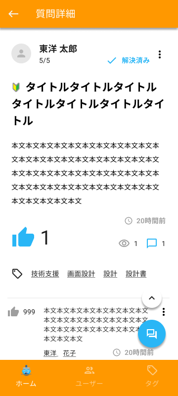

質問詳細画面を作成します。

デザインシステムとAPI仕様を参照して、作業を進めてください。

## 補足

- API呼び出しは後で実装するので、APIの戻り値は一旦、ソースコード上に直接記述しておく
- 一覧画面（ホーム画面）のイベントタイトル押下時に当画面へ遷移するようにする
- 質問に対する回答がある場合は、回答内容を表示する
- コメントアイコン
  - 質問または回答のコメントアイコン押下により、コメント表示エリアをアコーディオンのように開く
  - コメント表示エリアを表示している間はコメントアイコンの色を変える。もう一度押下するとコメント表示エリアを閉じてアイコンの色をもとに戻す
  - 質問または回答に対してコメントがある場合はコメント内容を表示する
  - コメントが0件の場合は「コメントを追加する」ボタンのみ表示する
  - 「コメントを追加する」ボタン押下にてコメント入力フォームを表示する。その際「コメントを追加する」ボタンは非表示とする
  - コメント入力フォームに文字入力して確定した際にコメント登録APIを呼びだす。API呼び出しはこの後のAPI呼び出しのところで実装する
- いいねボタン
  - イベント詳細画面と同様
  - 質問に対するいいねのみ実装する。質問のコメント、回答、回答のコメントに対するいいねは実装範囲外とする
- 上スクロールボタン
  - 一覧画面（ホーム画面）と同様
- 回答作成ボタン
  - 回答作成ボタンは詳細画面の上に重ね、一覧画面をスクロールしても新規作成ボタンの表示位置は固定とする
  - 回答作成ボタン押下時の画面遷移は後の入力画面作成のところで実装する
- ヘッダ
  - 戻るボタンと画面タイトルを表示する
- フッタのホームボタン
  - 押下により、一覧画面へ遷移する
