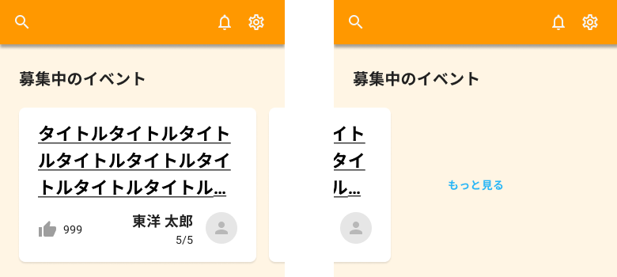

各表示部品ができたところで、一覧画面を作成していきます。まずは画面上部のイベント表示部分について作成します。

デザインシステムとAPI仕様を参照して、作業を進めてください。

## 補足

- API呼び出しは後で実装するので、APIの戻り値は一旦、ソースコード上に直接記述しておく
- 掲載期間中のイベントのみを画面に表示する
- 「もっと見る」ボタン押下時の画面遷移は、後のイベント一覧画面作成のところで実装する
