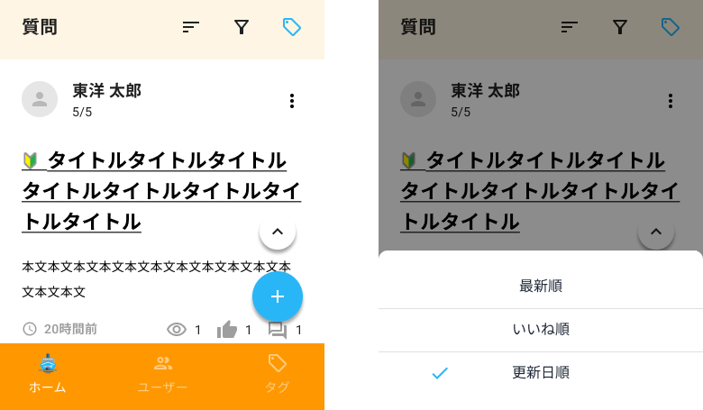

次に、質問表示部分と各ボタンが押下されたときの動きを作成してください。

## 補足

- API呼び出しは後で実装するので、APIの戻り値は一旦、ソースコード上に直接記述しておく
- 縦スクロール時に質問部のラベル行を画面上部に固定する仕様は応用編で実装するため、現時点では質問部のラベル行は画面外にスクロールされてしまってよい
- ページ最上部で下にスワイプして離すとpull to refreshとなるようにする
- refresh中はローディング中であることがわかるように、アクティビティインジケータを表示する
- 無限スクロールとなるようにする
- ソート
  - ソートアイコン押下で画面下部にソート条件の選択肢を表示する。初期選択値は最新順。現在選択されている選択肢がある場合は選択肢横にチェックマークを表示する。複数選択は不可とする
  - 最新順以外が選択されている状態のときはソートアイコンに色を付ける
  - フィルタが有効化された場合は、ソート順は最新順にリセットする
- フィルタ
  - フィルタアイコン押下で画面下部にフィルタ項目の選択肢を表示する。初期は未選択の状態。現在選択されている選択肢がある場合は選択肢横にチェックマークを表示する。複数選択は不可とする
  - フィルタしている状態のときはフィルタアイコンに色を付ける
  - ソートが有効化された場合は、フィルタは無しにリセットする
- タグによる絞り込み
  - タグアイコン押下で画面下部にタグの一覧を表示する。初期は未選択の状態。単一選択とする
  - タグでフィルタしている状態のときはタグアイコンに色を付ける
  - タグによる絞り込みについては、ソート・フィルタと同時指定を可能とする
- 上スクロールボタン
  - Androidのみ表示する
  - 上スクロールボタン押下で画面再上部にスクロールとなるようにする
  - 上スクロールボタンは一覧画面の上に重ね、一覧画面をスクロールしても上スクロールボタンの表示位置は固定とする
  - iOSはスクロールバーをタップすることでOSの機能により画面上部にスクロールすることを確認すること
- 新規作成ボタン
  - 新規作成ボタンは一覧画面の上に重ね、一覧画面をスクロールしても新規作成ボタンの表示位置は固定とする
  - 新規作成ボタン押下時の画面遷移は後の入力画面作成のところで実装する
- ヘッダの検索ボタン
  - 検索キーワードを入力して押下することにより、検索にヒットした質問のみを表示する
- ヘッダのベルアイコン
  - 押下により、お知らせリンクの一覧をdrawerで表示する
- フッタのホームボタン
  - 押下により、一覧画面（ホーム画面）を再読み込みする
