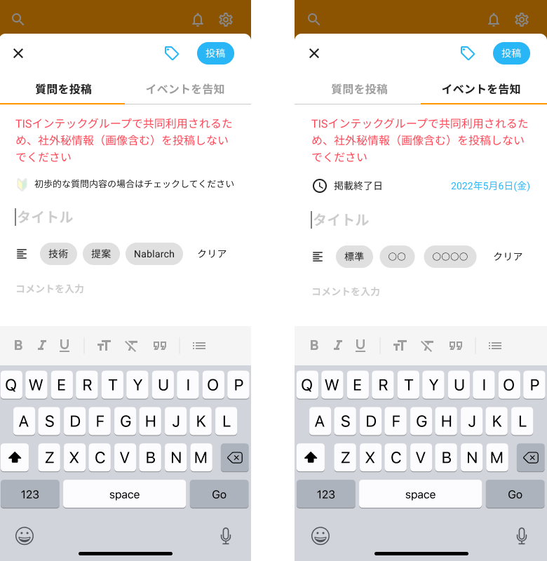

入力画面を作成します。

デザインシステムとAPI仕様を参照して、作業を進めてください。

## 補足

- API呼び出しは後で実装するので、APIの戻り値は一旦、ソースコード上に直接記述しておく
- モーダル（画面の枠）作成
  - React Navigationで前画面の上に入力画面をモーダルで開く画面遷移を実装する
  - 一覧画面（ホーム画面）の新規作成ボタン押下時に当画面へ遷移するようにする
  - イベント一覧画面の回答作成ボタン押下時に当画面へ遷移するようにする
  - モーダルは固定（下スワイプで閉じたりしない）
- 質問とイベントのタブの作成
  - モーダル上部の質問/イベントタブにて質問入力とイベント入力をタブで切り替えられるようにする
- タグボタン
  - タグボタン押下でタグの一覧を画面下部に表示する
  - タグは複数選択可能とし、選択されているタグについては色を変える
- 初心者マーク
  - デフォルトは非活性。押下の度に活性/非活性を切り替える
- 質問・イベント内容の入力フォームを作成する
  - マークダウン入力は応用編で実装するため、現時点では非対応でよい
- テンプレート入力ボタン
  - 各テンプレートボタン押下にて選択されたテンプレート内容を詳細入力欄に入力された状態とする
  - テンプレートの入力内容はAPI呼び出しにて取得する。この後のAPI呼び出しのところで実装する
  - クリア押下にて詳細入力欄に入力された内容を削除する
- 入力モーダル左上の「×」押下で入力モーダルを閉じ、前画面を表示する
- 投稿ボタン押下で入力モーダルを閉じ、前画面を表示する
- 入力精査
  - 質問、イベントの最大文字数チェック
  - イベント掲載期間の日付チェック（当日以降、入力有無）エラーの場合はエラーメッセージを表示する
- タブ切り替え時の警告ダイアログ
  - 入力フォームに入力された状態で、質問・イベントのタグを切り替えようとすると、入力内容がクリアされる警告ダイアログを表示する
