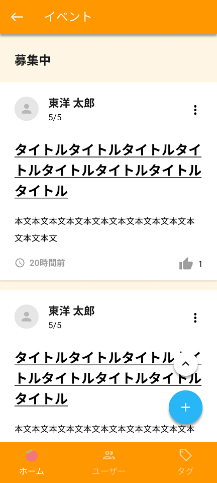

イベントの一覧画面を作成します。

デザインシステムとAPI仕様を参照して、作業を進めてください。

## 補足
- API呼び出しは後で実装するので、APIの戻り値は一旦、ソースコード上に直接記述しておく
- 一覧画面（ホーム画面）のもっと見るボタン押下時に当画面に遷移するようにする
- すべてのイベントを表示する
- ページ最上部で下にスワイプして離すとpull to refreshとなるようにする
- refresh中はローディングアニメを表示する
- 無限スクロールとなるようにする
- 上スクロールボタン
  - 一覧画面（ホーム画面）と同様
- 新規作成ボタン
  - 一覧画面（ホーム画面）と同様
- ヘッダ
  - 戻るボタンと画面タイトルを表示する
- フッタのホームボタン
  - 押下により、一覧画面へ遷移する
