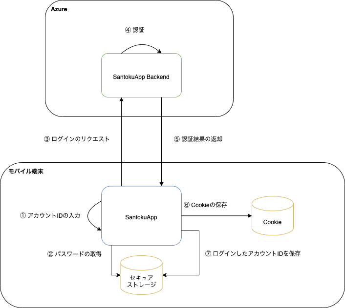
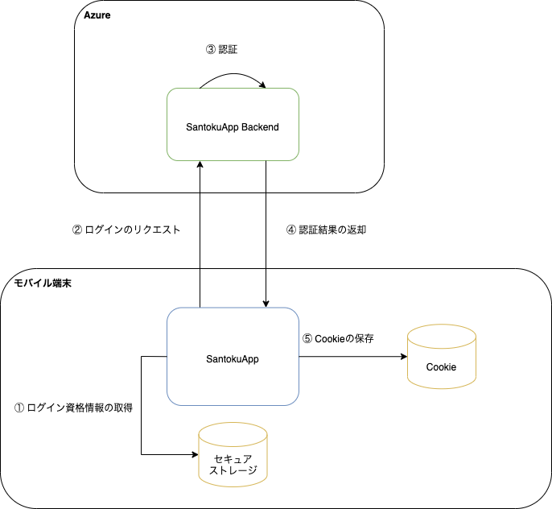

このアプリでは、ユーザが本人であることを確認するために、Cookieベースの認証機能を提供します。ID・パスワードを用いて認証し、SantokuApp BackendからCookie経由でセッションIDを受け取ります。

認証後は、SantokuApp BackendへのHTTPリクエスト送信時に、Cookie経由でセッションIDを渡すことにより認証状態を維持します。

なお、このアプリではログインの手段として以下の2つを提供します。

- ログイン画面でアカウントIDを入力して、SantokuApp Backendにログインリクエストを送信
- 端末に保存されたログイン資格情報を用いて、SantokuApp Backendにログインリクエストを送信（以降、自動ログインと呼びます）

## ログイン画面でアカウントIDを入力してログイン

アプリからログアウトした場合は、ログイン画面からアカウントIDを入力してログインします。パスワードは、[サインアップ](signup.mdx)後に保存したセキュアストレージから取得します。

### 処理フロー

| No | 処理 | 内容 |
|:--|:--|:--|
| ① | アカウントIDの入力 | ユーザは、ログイン画面でアカウントIDを入力します。 |
| ② | パスワードの取得 | SantokuAppは、セキュアストレージからアカウントIDに紐づくパスワード取得します。 |
| ③ | ログインのリクエスト | SantokuAppは、アカウントIDとパスワードを用いてSantokuApp Backendにログインリクエストを送ります。 |
| ④ | 認証 | SantokuApp Backendは、ログインリクエストで受け取ったアカウントIDとパスワードを用いて認証処理をします。 |
| ⑤ | 認証結果の返却 | SantokuApp Backendは認証処理の結果をSantokuAppに返却します。|
| ⑥ | Cookieの保存 | SantokuAppは、SantokuApp Backendから認証処理の結果を受け取って、Cookie（セッションID）を保存します。Cookieの保存に関しては、[認証状態の維持](login.mdx#認証状態の維持)を参照してください。 |
| ⑦ | ログインしたアカウントIDを保存 | SantokuAppは、入力されたアカウントIDをセキュアストレージに保存します。 |

## 自動ログイン

ログイン資格情報をセキュアストレージから取得してログインします。ユーザにログイン操作を要求することなくログインできるため、アプリの利便性が向上します。

このアプリでは、以下の場合に自動ログインをします。

- サインアップに成功した場合
- アプリにログイン後、ログアウトせずにアプリを終了してアプリを再起動した場合
- アプリ使用中にセッションIDの有効期限が切れた場合

<!-- markdownlint-disable MD024 -->

### 処理フロー

<!-- markdownlint-enable MD024 -->

| No | 処理 | 内容 |
|:--|:--|:--|
| ① | ログイン資格情報の取得 | SantokuAppは、セキュアストレージから前回ログインしていたアカウントIDと、そのアカウントIDに紐づくパスワード取得します。 ただし、サインアップ後は前回ログインしていたアカウントIDではなく、[SantokuApp Backendから返却されたアカウントID](signup.mdx#処理フロー)を使用します。 |
| ② | ログインのリクエスト | SantokuAppは、アカウントIDとパスワードを用いてSantokuApp Backendにログインリクエストを送ります。 |
| ③ | 認証 | SantokuApp Backendは、ログインリクエストで受け取ったアカウントIDとパスワードを用いて認証処理をします。 |
| ④ | 認証結果の返却 | SantokuApp Backendは認証処理の結果をSantokuAppに返却します。|
| ⑤ | Cookieの保存 | SantokuAppは、SantokuApp Backendから認証処理の結果を受け取って、Cookie（セッションID）を保存します。Cookieの保存に関しては、[認証状態の維持](login.mdx#認証状態の維持)を参照してください。 |

## 認証状態の維持

SantokuApp BackendへのHTTPリクエスト送信時に、Cookie経由でセッションIDを渡すことにより認証状態を維持します。

認証後に受け取ったCookie（セッションID）など、HTTPレスポンスとして受け取ったCookieは、ネイティブの機能で端末内に自動で保持されます。SantokuApp BackendへのHTTPリクエスト送信時には、ネイティブの機能でCookie（セッションID）を透過的に設定します。

なお、セッションIDには有効期限があります。有効期限が切れた場合は自動ログインを使用して再度セッションIDを取得します。
