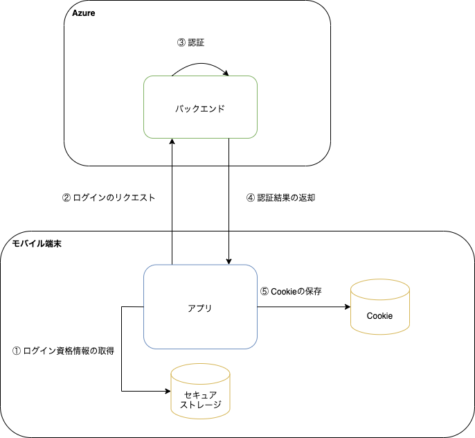

このアプリでは、ユーザが本人であることを確認するために、Cookieベースの認証機能を提供します。ID・パスワードを用いて認証し、SantokuApp BackendからCookieでセッションIDを受け取ります。

認証後は、SantokuApp BackendへのHTTPリクエスト送信時に、Cookie経由でセッションIDを渡すことにより認証状態を維持します。

なお、このアプリではログインの手段として以下の2つを提供します。

- ログイン画面でアカウントIDを入力して、SantokuApp Backendにログインリクエストを送信
- 端末に保存されたログイン資格情報を用いて、SantokuApp Backendにログインリクエストを送信（以降、自動ログインと呼びます）

## ログイン画面でアカウントIDを入力してログイン

アプリからログアウトした場合は、ログイン画面からアカウントIDを入力してログインします。パスワードは、[サインアップ](signup.mdx)後に保存した[端末内の安全な場所](credential-management.mdx)から取得します。

### 処理フロー

| No | 処理 | 内容 |
|:--|:--|:--|
| ① | アカウントIDの入力 | ユーザは、ログイン画面でアカウントIDを入力します。 |
| ② | パスワードの取得 | SantokuAppは、端末内の安全な場所からアカウントIDに紐づくパスワード取得します。 |
| ③ | ログインのリクエスト | SantokuAppは、アカウントIDとパスワードを用いてSantokuApp Backendにログインリクエストを送ります。 |
| ④ | 認証 | SantokuApp Backendは、ログインリクエストで受け取ったアカウントIDとパスワードを用いて認証処理をします。 |
| ⑤ | 認証結果の返却 | SantokuApp Backendは認証処理の結果をSantokuAppに返却します。|
| ⑥ | Cookieの保存 | SantokuAppは、SantokuApp Backendから認証処理の結果を受け取って、Cookie（セッションID）を保存します。Cookieの保存に関しては、[認証状態の保持](login.mdx#認証状態の保持)を参照してください。 |
| ⑦ | ログイン中のアカウントIDを保存 | SantokuAppは、ログイン中のアカウントIDとして、入力されたアカウントIDを端末内の安全な場所に保存します。 |

## 自動ログイン

ログイン資格情報を端末内の安全な場所から取得してログインします。ユーザにログイン操作を要求することなくログインできるため、アプリの利便性が向上します。

このアプリでは、以下の場合に自動ログインをします。

- サインアップに成功した場合
- アプリにログイン後、ログアウトせずにアプリを終了してアプリを再起動した場合
- アプリ使用中にセッションIDの有効期限が切れた場合

### 処理フロー

| No | 処理 | 内容 |
|:--|:--|:--|
| ① | ログイン資格情報の取得 | SantokuAppは、端末内の安全な場所から前回ログインしていたアカウントIDと、そのアカウントIDに紐づくパスワード取得します。 |
| ② | ログインのリクエスト | SantokuAppは、アカウントIDとパスワードを用いてSantokuApp Backendにログインリクエストを送ります。 |
| ③ | 認証 | SantokuApp Backendは、ログインリクエストで受け取ったアカウントIDとパスワードを用いて認証処理をします。 |
| ④ | 認証結果の返却 | SantokuApp Backendは認証処理の結果をSantokuAppに返却します。|
| ⑤ | Cookieの保存 | SantokuAppは、SantokuApp Backendから認証処理の結果を受け取って、Cookie（セッションID）を保存します。Cookieの保存に関しては、[認証状態の保持](login.mdx#認証状態の保持)を参照してください。 |

## 認証状態の保持

SantokuApp BackendへのHTTPリクエスト送信時に、Cookie経由でセッションIDを渡すことにより認証状態を維持します。

認証後に受け取ったCookie（セッションID）など、HTTPレスポンスとして受け取ったCookieは、ネイティブの機能で端末内に自動で保持されます。SantokuApp BackendへのHTTPリクエスト送信時には、ネイティブの機能でCookie（セッションID）を透過的に設定します。

なお、セッションIDには有効期限があります。有効期限が切れた場合は自動ログインを使用して再度セッションIDを取得します。詳細は、[HTTPステータスコードが4xxのエラーハンドリング](../http-api/http-api-error-handling#httpステータスコードが4xxのエラーハンドリング)を参照してください。

## FetchとCookieベースの認証に関する既知の問題
