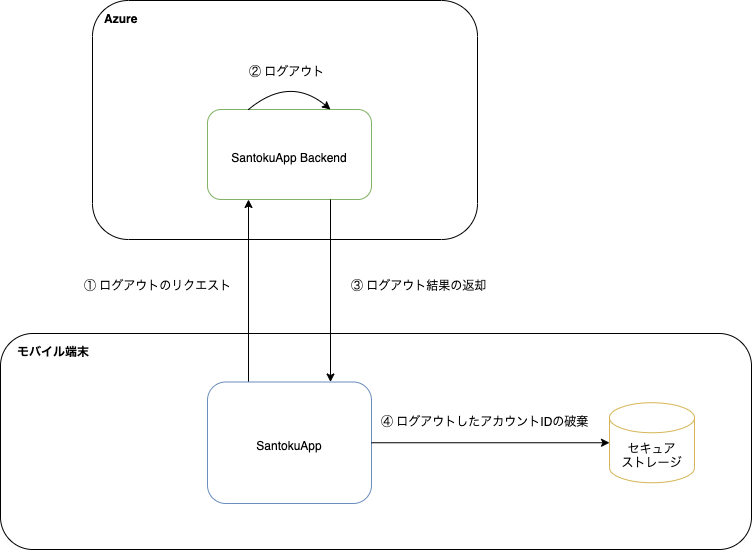

このアプリでは、Cookie経由で受け渡すセッションIDの破棄と、[端末内の安全な場所](credential-management.md)からログイン中のアカウントIDを破棄することでログアウトします。

なお、ログアウト後も端末内の安全な場所にパスワードは保持します。 ユーザはログイン画面からアカウントIDを入力することにより、同じアカウントで再度ログインできます。

## 処理フロー

ログアウトの処理フローは以下になります。

| No | 処理 | 内容 |
|:--|:--|:--|
| ① | ログアウトのリクエスト | SantokuAppは、SantokuApp Backendにログアウトリクエストを送ります。ネイティブの機能を利用して、端末内に保持されたCookie（セッションID）をHTTPリクエストに設定します。 |
| ② | ログアウト | SantokuApp Backendは、ログアウト処理（セッションIDの破棄）をします。 |
| ③ | ログアウト結果の返却 | SantokuApp Backendはログアウト処理の結果をSantokuAppに返却します。 |
| ④ | Cookieの破棄 | SantokuAppは、SantokuApp Backendからログアウト処理の結果を受け取って、Cookieを破棄します。Cookieの破棄はネイティブの機能で透過的に実施されます。 |
| ⑤ | ログアウトしたアカウントIDの破棄 | SantokuAppは、ログイン中のアカウントIDとして保存していたアカウントIDを、[端末内の安全な場所](credential-management.mdx)から破棄します。 |
