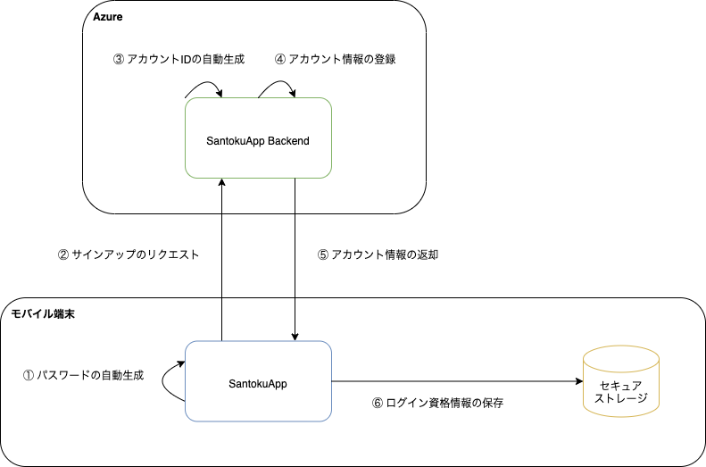

このアプリでは、自動サインアップ機能を提供します。ユーザはサインアップ操作なしにアプリを利用できます。

自動サインアップ機能を実現するために、ログイン資格情報をアプリで自動生成してアカウントを作成します。なお、このアプリにおけるログイン資格情報は以下を表します。

- アカウントID
- パスワード

作成したログイン資格情報は、セキュアストレージに保存します。

## 処理フロー

サインアップの処理フローは以下になります。

| No | 処理 | 内容 |
|:--|:--|:--|
| ① | パスワードの自動生成 | SantokuAppは、パスワードを自動生成します。パスワードは16桁のランダムな文字列で構成されます。 |
| ② | サインアップのリクエスト | SantokuAppは、生成したパスワードなどを用いてSantokuApp Backendにサインアップリクエストを送ります。 |
| ③ | アカウントIDの自動生成 | SantokuApp Backendは、サインアップリクエストを受け取ると、アカウントIDを自動生成します。アカウントIDはUUID（v4）で生成します。 |
| ④ | アカウント情報の登録 | SantokuApp Backendは、生成したアカウントIDとSantokuAppから受け取ったパスワードなどを用いてアカウント情報をデータストアに保存します。 |
| ⑤ | アカウント情報の返却 | SantokuApp BackendはSantokuAppにアカウント情報を返却します。|
| ⑥ | ログイン資格情報の保存 | SantokuAppは、受け取ったアカウント情報からログイン資格情報を取得して、セキュアストレージに保存します。 |
