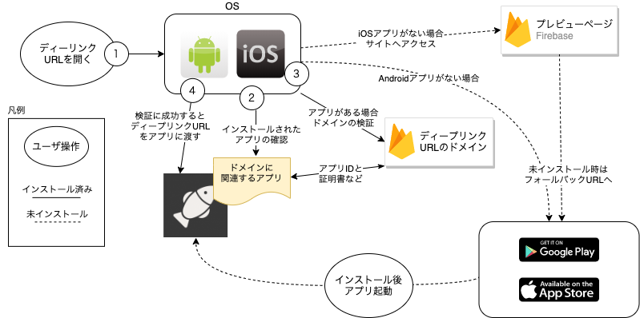
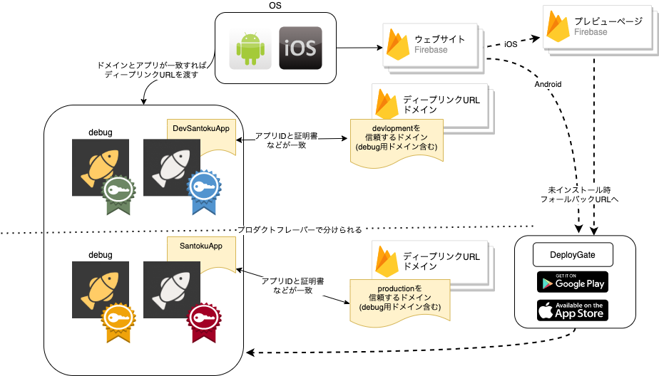

ユーザが他のユーザに情報を共有する方法としては次のような方法があります。

 1. 他のユーザから入力する情報を教えてもらい、アプリケーション内で入力する
 1. SNSやメール、QRコードURLを受け取り、アプリケーションにわたす

上記の2のディープリンクを利用することで、情報共有の仕組みをアプリで作り込まずに、ユーザ間でURLを共有することで実現できます。
アプリケーション内で入力するより、URLを開くだけで操作できる方がユーザ体験を向上できるためディープリンクを利用します。

ここでは、ディープリンクの実現方式として[Firebase Dynamic Links](https://firebase.google.com/docs/dynamic-links)を利用した実現方式を記載します。

## 全体の構成

まずDynamic LinksのURLやリンクなどについて説明します。

|URLの種類|説明|
|:-------|:--|
|ディープリンクURL|ユーザが開くURLで、OSがドメインとの関連を検証するときに利用するURLです。OSの検証が成功するとアプリケーションに渡されます。|
|コンテンツリンク|ディープリンクURLに含まれるコンテンツを指定するためのURL形式のリンクです。Dynamic LinksではSDKを利用してディープリンクURLから取得します。|
|[プレビューページ](https://firebase.google.com/docs/dynamic-links/link-previews#app_preview_pages)|iOSでディープリンクURLに対応するアプリケーションがインストールされていない場合に表示されるページです。|
|フォールバックURL|アプリがインストールされていない場合にユーザがアクセスするURLです。アプリのインストール用のURLなどを設定します。|

ディープリンクの全体の構成を以下に示します。

ディープリンクURLを開くと、下記の図のようにOSがアプリとディープリンクURL（ドメイン）の関連を検証します。
アプリケーションとドメインが相互に関連を持っていることが検証できると対象のアプリケーションにディープリンクURLを渡します。

アプリケーションとドメインの関連については[iOS](https://firebase.google.com/docs/dynamic-links/ios/receive)[^1]と[Android](https://firebase.google.com/docs/dynamic-links/android/receive)を参照してください。

[^1]:iOSで[関連するドメイン（Associated Domains）](https://help.apple.com/developer-account/#/dev21218dfd6)の機能を利用するためにはADPかADEPライセンスが必要です。

SantokuAppではDynamic Linksを利用するため、破線で示す[未インストール時のフロー](https://firebase.google.com/docs/dynamic-links/operating-system-integrations)も実現します。

（図の④で）アプリケーションはOSからディープリンクURLを受け取ったあと、Firebase Dynamic LinksのSDKを利用してコンテンツリンクを取得します。

### 利用するライブラリ

React NativeでFirebase Dynamic Linksを利用するために[React Native Firebase Dynamic Links](https://rnfirebase.io/dynamic-links/usage)を利用します。

React Native Linkingを利用してディープリンクURLを受け取ることはできますが、ディープリンクURLからコンテンツリンクを取得する機能がありません。また、未インストール時のフローに対応できません。

React Native Firebaseの導入については[React Native Fireabase](https://rnfirebase.io/)と[Dynamic Link](https://rnfirebase.io/dynamic-links/usage)を参照してください。

### ディープリンクURLに対応するWebサイト

Dynamic Linksを利用しない場合、ディープリンクは[Android App Links](https://developer.android.com/training/app-links#app-links-vs-deep-links)でも説明されているようにWebサイトとモバイルアプリで同等の機能を提供することが必要です。

本プロジェクトでは[Dynamic Linksの仕組み](https://firebase.google.com/docs/dynamic-links#how-does-it-work)を利用しWebサイトではコンテンツリンクに対応するをコンテンツを提供しません。

またディーリンクURLで利用するドメインは独自の[カスタムドメイン](https://firebase.google.com/docs/dynamic-links/custom-domains)ではなく`page.link`サブドメインを利用します。

### テスト

ディープリンクを利用した機能のテストをする場合、本番環境とは異なるフォールバックURLからインストールします。
本番環境ではリリースされたアプリのバージョンを利用しますが、テスト時には開発中のバージョンを利用するためです。

モバイルアプリの設定の切り替えは[ビルドバリアント](../../development/build-configuration.mdx)の説明に沿った形式で[Firebaseアプリ](https://firebase.google.com/docs/projects/learn-more)とモバイルアプリをひもづけます。

SantokuAppではテストにはDeployGate、本番環境は公式のStoreで配信します。

フォールバックURLはディープリンクURLを構成する要素なので、ディープリンクURLを作成時に[react-native-config](https://github.com/luggit/react-native-config)で切り替えられます。

下記の図で緑色にしている部分がテスト環境用のものです。

