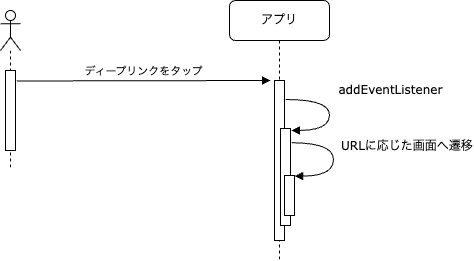
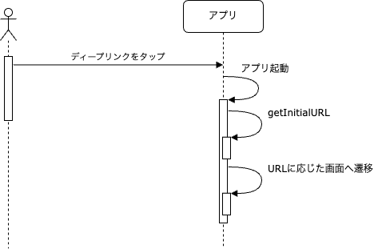
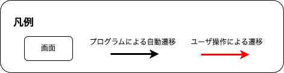
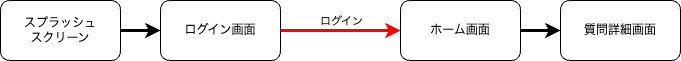
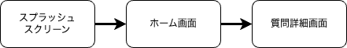

ディープリンクをアプリケーションで処理する方法について記載します。

## ディープリンクタップ時の処理フロー

ユーザがディープリンクをタップするとアプリがフォアグランドで表示します。
その際のアプリスタートの種類によりディープリンクの取り扱いが変わります。
アプリスタートの種類には次のものがあります。

- コールドスタート
- ウォームスタート
- ホットスタート

アプリスタートの種類の詳細は[アプリスタートの種類に応じた初期化処理](../life-cycle-management/overview.mdx#アプリスタートの種類に応じた初期化処理)を参照してください。

処理フローは以下になります。

### ホットスタートの場合

ホットスタートの場合、Expo Linkingの[addEventListener](https://docs.expo.dev/versions/latest/sdk/linking/#linkingaddeventlistenertype-handler)に設定した処理が呼ばれます。
この中でURLに応じた処理（画面遷移など）を行います。

### コールドスタートまたはウォームスタートの場合

React Nativeアプリでは、コールドスタートとウォームスタートはほぼ同等です。
コールドスタートまたはウォームスタートの場合、Expo Linkingの[getInitialURL](https://docs.expo.dev/versions/latest/sdk/linking/#linkinggetinitialurl)で取得したURLに応じた処理（画面遷移など）を行います。

---

> TODO: 以降は書き直し予定

## ディープリンクに応じた画面遷移とバリデーション

このアプリでは、特定のパスやクエリパラメータに合致した場合のみディープリンクを受け取ります。受け取ったパスやクエリパラメータに応じてバリデーションを実施し、画面を表示します。

ここに定義されていないパスやクエリパラメータが指定されたURLをタップした場合は、アプリではなくブラウザでそのURLに応じたページが表示されます。

> TODO: そもそもクエリパラメータじゃない

| パス              | クエリパラメータ   | 説明                                                                                                                                                                                                                                |
|:----------------|:-----------|:----------------------------------------------------------------------------------------------------------------------------------------------------------------------------------------------------------------------------------|
| /question       | questionId | クエリパラメータに指定された`questionId`に該当する質問を、質問詳細画面に表示します。`questionId`に値が設定されていない場合や、`questionId`に設定された値が整数以外の場合は質問詳細画面にエラーメッセージを表示します。  なお、`questionId`がクエリパラメータのキーとして存在しない場合は、ディープリンクをタップしてもこのアプリは表示されません。（ブラウザでタップしたURLが表示されます。） |
| /demo/deep-link | *          | クエリパラメータの有無に関わらず、ディープリンク用のデモ画面を表示します。クエリパラメータが存在していた場合は、デモ画面にそれらを表示します。受け取ったクエリパラメータをテキスト表示するだけなので、クエリパラメータのバリデーションは実施しません。                                                                                                       |

:::warning
[Universal Linksの警告](https://developer.apple.com/documentation/xcode/supporting-universal-links-in-your-app)にもあるように、タップされたURLが妥当なURLかを必ず検証してから使用するようにしてください。
:::

### 未ログイン時や戻るボタンの対応

このアプリでは、未ログイン時に質問詳細画面やデモ画面を表示することはできません。そのため、未ログイン時にディープリンクをタップした場合はログイン画面を表示し、ログイン後、質問詳細画面やデモ画面を表示します。

また、質問詳細画面やデモ画面には前に表示していた画面に戻るためのボタンがあります。ディープリンクをタップしてコールドスタートやウォームスタートした場合、質問詳細画面やデモ画面のみをナビゲーションのスタックに追加するだけでは、前の画面が存在しないため戻るボタンが機能しません。

これらを考慮して、このアプリでは以下のフローでディープリンクに応じた画面を表示します。

#### 質問詳細画面への遷移

| ログイン 未済 | スタート の種類  | 遷移フロー                                                        |
|:------------|:--------------|:-------------------------------------------------------------|
| 未済          | コールド ウォーム |  |
| 未済          | ホット           |  |
| 済           | コールド ウォーム |  |
| 済           | ホット           |  |

#### デモ画面への遷移

> TODO
