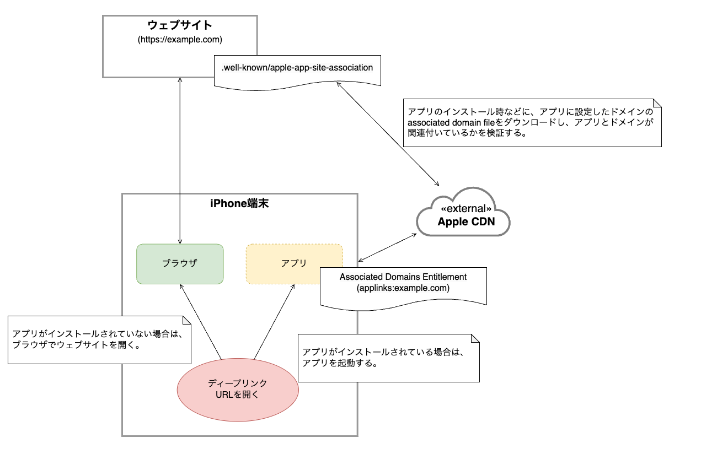

[Universal Links](https://developer.apple.com/ios/universal-links/)は、iOSが標準機能として提供しているディープリンクです。

Universal Linksで作成するURLはHTTPリンクであるため、1つのURLでアプリとウェブサイトの両方に対応できます。
また、後述する[アプリとドメインの関連付け](#アプリとドメインの関連付け)により、このアプリが提供するUniversal Linksを他のアプリに乗っ取られるようなリスクはありません。

## Universal Linksの全体概要

Universal Linksを使用したアプリ起動の全体概要は以下になります。



| 処理            | 内容                                                                                                                                                                                                                               |
|:--------------|:---------------------------------------------------------------------------------------------------------------------------------------------------------------------------------------------------------------------------------|
| アプリとドメインの関連付け | OSは、アプリのインストール時などにアプリのAssociated Domains Entitlementに設定されたドメインの`associated domain file`をダウンロードします。<br/>ダウンロードした`associated domain file`に記載されている`Application Identifier Prefix`や`Bundle Identifier`がアプリと一致した場合、アプリとドメインが関連付けられます。 |
| ディープリンクURLを開く | ユーザがディープリンクURLを開いた場合、URLのドメインに関連付けられたアプリが端末にインストールされていれば、アプリが起動します。ドメインに関連付けられたアプリがインストールされていない場合は、ブラウザでウェブサイトを開きます。                                                                                                             |

## アプリとドメインの関連付け

Universal Linksは、アプリとドメインを関連付けることでディープリンクURLの安全を保証します。

アプリとドメインの関連付けは、[Supporting associated domains](https://developer.apple.com/documentation/xcode/supporting-associated-domains)に記載されている通り、以下の設定が必要です。

- Associated Domains Entitlementの追加
- `associated domain file`をウェブサイトに配置

### Associated Domains Entitlementの追加

Associated Domains Entitlementには、アプリと関連付けるドメインを設定します。ここで設定されたドメインから`associated domain file`をダウンロードし、アプリとドメインが関連付けられます。

Associated Domains Entitlementは、以下の手順で追加します。

- XcodeのCapabilitiesから`Associated Domains`を選択
- 追加されたEntitlementのDomainsに`applinks:[関連付けるドメイン]`を追加
  - 複数のサブドメインをサポートする場合は、全てのドメインを追加

詳細は、以下のドキュメントを参照してください。

- [Configuring an associated domain](https://developer.apple.com/documentation/xcode/configuring-an-associated-domain)

なお、Xcodeの`Signing & Capabilities`で`Automatically manage signing`を設定していない場合は、追加で以下の手順が必要になります。

- Apple Developer Programの`Certificates, Identifiers & Profiles > Identifiers`でアプリのApp IDを選択
- Capabilitiesに`Associated Domains`を追加
- Apple Developer Programの`Certificates, Identifiers & Profiles > Profiles`でProvisioning Profileを更新
- 更新したProvisioning Profileをダウンロードして、XcodeのProvisioning Profileに設定

:::note
Xcodeの`Signing & Capabilities`で`Automatically manage signing`を設定している場合は、上記手順をXcodeが自動で実施してくれます。
:::

### `associated domain file`をウェブサイトに配置

`associated domain file`は、アプリと関連付けるドメインに配置するファイルです。ファイル名は`apple-app-site-association`とし、JSON形式で記述します。

このファイルには、関連付けるアプリの`Application Identifier Prefix`や`Bundle Identifier`、Universal Linksとして受け付けるパスなどを指定します。

詳細は、以下のドキュメントを参照してください。

- [Add the associated domain file to your website](https://developer.apple.com/documentation/xcode/supporting-associated-domains#Add-the-associated-domain-file-to-your-website)
- [applinks](https://developer.apple.com/documentation/bundleresources/applinks)

```json title=apple-app-site-associationの例
{
  "applinks": {
      "details": [
           {
             "appIDs": [ "ABCDE12345.jp.fintan.mobile.SantokuApp"],
             "components": [
               {
                  "/": "/demo/deep-link",
                  "comment": "デモのディープリンクページを表示する。"
               },
               {
                  "/": "/question",
                  "?": { "questionId": "*" },
                 "comment": "質問詳細画面を表示する。クエリパラメータとしてquestionIdの指定が必要。"
               }
             ]
           }
       ]
   }
}
```

作成した`associated domain file`は、ウェブサイトの`.well-known`ディレクトリに配置します。

```console
https://[ドメイン]/.well-known/apple-app-site-association
```

また、以下の要件を満たして配信する必要があります。

- `Content-Type`が`application/json`である
- HTTPS接続でアクセスできる
- リダイレクトなしでアクセスできる（`301`リダイレクトや`302`リダイレクトがない）
- 複数のサブドメインをサポートしている場合、各ドメインで`associated domain file`を公開する必要がある

ウェブサイトに配置された`associated domain file`は、アプリのインストール時や一定周期で、OSがAppleのCDNを経由してダウンロードします。

:::warning
[Appleのドキュメント](https://developer.apple.com/documentation/xcode/supporting-associated-domains#Add-the-associated-domains-entitlement-to-your-app)には、`associated domain file`をダウンロードするタイミングとして以下の記載があります。

> When a user installs your app, the system attempts to download the associated domain file and verify the domains in your entitlement.
> Devices check for updates approximately once per week after app installation.

アプリのインストール時や、約1週間に一度の頻度で`associated domain file`をダウンロードするようです。ただし、アプリが更新された場合に、`associated domain file`を（再）取得するかについては明記されていません。

そのため、`associated domain file`に定義したパスを更新した場合に、それが即時反映されるかどうかは不明です。
:::

:::warning
[Appleのドキュメント](https://developer.apple.com/documentation/xcode/supporting-associated-domains#Add-the-associated-domains-entitlement-to-your-app)には、ウェブサイトの`associated domain file`がAppleのCDNに反映されるまで最大24時間かかると記載されています。

> Apple’s content delivery network requests the apple-app-site-association file for your domain within 24 hours.
:::

:::note
[Appleのドキュメント](https://developer.apple.com/documentation/xcode/supporting-associated-domains#Add-the-associated-domains-entitlement-to-your-app)には、`associated domain file`がAppleのCDN経由でダウンロードされるのは、iOS14以降と記載されています。
iOS14未満の場合は、ウェブサイトから直接ダウンロードされます。

> Starting with macOS 11 and iOS 14, apps no longer send requests for apple-app-site-association files directly to your web server. Instead, they send these requests to an Apple-managed content delivery network (CDN) dedicated to associated domains.

:::

なお、開発時は`associated domain file`を配置するウェブサイトのアクセスがIPなどにより制限されている場合があります。その場合、AppleのCDNが`associated domain file`にアクセスできません。

上記を解決する手段として、Associated Domains Entitlementで指定したドメインに`alternate mode`を設定する方法があります。

`alternate mode`を設定することでAppleのCDN経由ではなく、ウェブサイトから直接ダウンロードが可能です。

詳細は、[Enable alternate mode for unreachable servers](https://developer.apple.com/documentation/xcode/configuring-an-associated-domain#Enable-alternate-mode-for-unreachable-servers)を参照してください。

:::warning
`alternate mode`は、配布用のProvisioning Profileで署名されたアプリでは使用できません。
開発用のProvisioning Profileで署名されたアプリをインストールするか、MDMで配布する必要があります。
:::
