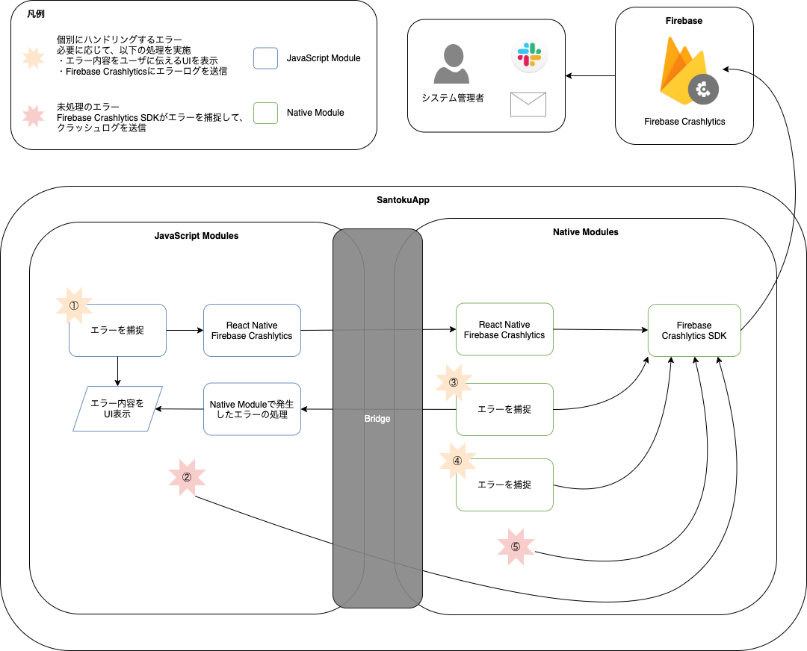

モバイルアプリでは、エラーが発生した場合にエラーの内容と、どのような手順で操作をすればエラーから回復できるかをユーザに伝える事が大切です。何も伝えずにアプリがクラッシュしてしまうと、ユーザのアプリ離脱率が高くなる一因になります。また、アプリがクラッシュしてしまった場合は、どのような操作でアプリがクラッシュしたかを特定することも重要です。

React Nativeを使用したモバイルアプリでは、発生したエラーをハンドリングしないとアプリがクラッシュします。
そのため基本方針として、エラーの発生する可能性がある箇所については個別にエラーを捕捉してエラーの内容と復旧手順を適切にユーザに伝えます。また、必要に応じてFirebase Crashlyticsにエラーログを送信します。

ただし、エラーのハンドリング漏れが発生する可能性はないとは断言できないため、未処理のエラーを捕捉してFirebase Crashlyticsにクラッシュログを送信します。

## エラーハンドリングの全体像

