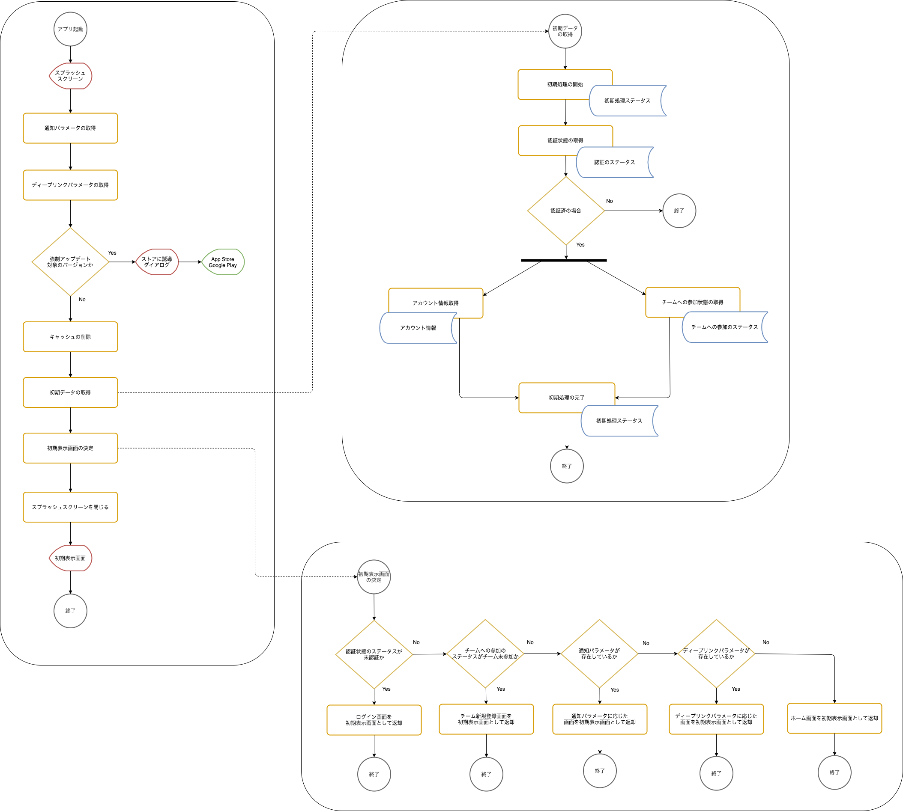

SantokuAppでは、アプリ起動後にスプラッシュスクリーンを表示してアプリの初期処理を実施します。初期処理は、アプリ起動後に確認しなければいけない事項のチェックや、アプリ全体で共有する情報を取得します。また、取得した情報などに応じてスプラッシュスクリーンを閉じた後に表示する画面を決定します。

## 初期処理のフロー

アプリの初期処理のフローは以下になります。

| 初期処理        |      概要      |
| ------------- | ------------- |
| 強制アップデート対象のバージョン確認 | 起動したアプリのバージョンが強制アップデートの対象かを確認します。対象の場合は、App Store、Google Playに誘導します。 |
| 初期データの取得 | アプリ全体で共有する情報を取得して、コンテクストに設定します。  |
| 認証状態の取得 | セキュアストレージに有効なリフレッシュトークンが存在するかを確認します。存在しない場合は、ログイン画面を表示します。認証状態の確認に関する詳細は、XXXを参照してください。 |
| 通知のパラメータを取得 | 通知領域に表示されたメッセージをクリックしてアプリ起動した場合は、通知パラメータを取得します。Push通知に含まれるデータの内容に応じて遷移先を決めます。 |
| Deep Linkのパラメータを取得 | Deep Linkから起動した場合は、Deep Linkに含まれるパラメータを取得します。Deep Linkのパラメータに応じて遷移先を決めます。 |
| アカウント情報の取得 | アカウント情報を取得して、アプリのどこからでも参照できるようにします。 |
