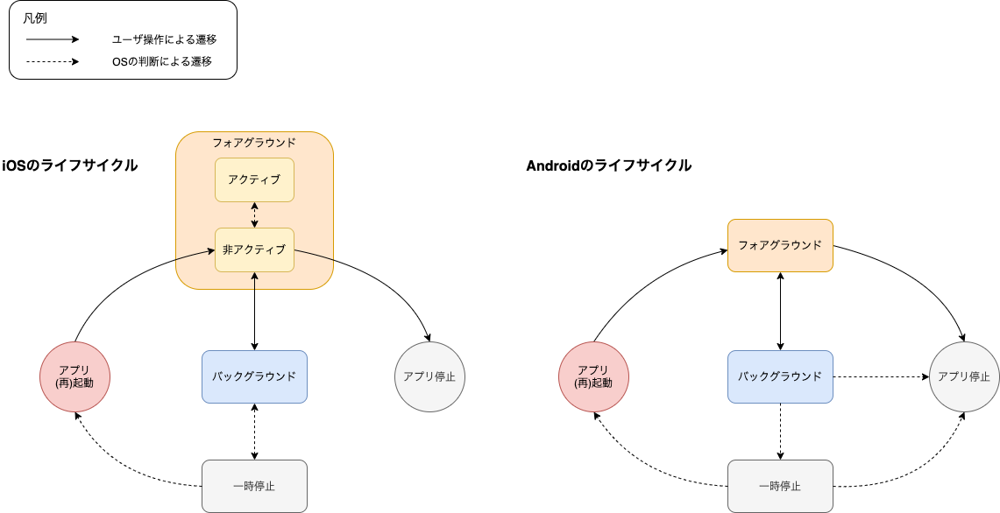

モバイルアプリでは、アプリの起動から停止までのライフサイクルの中で様々な状態に遷移します。

ユーザがSantokuAppの使用中に他のアプリを起動した場合、SantokuAppはバックグラウンドに移動します。ユーザが多くのアプリを起動している場合、バックグラウンドに移動したSantokuAppはOSの判断によって停止されることもあります。

以下は、モバイルアプリにおける一連のライフサイクルを表したものです。

ライフサイクルに関するより詳細は情報は、以下を参照してください。

- [Android - アクティビティのライフサイクルについて](https://developer.android.com/guide/components/activities/activity-lifecycle?hl=ja)
- [iOS - Managing Your App's Life Cycle](https://developer.apple.com/documentation/uikit/app_and_environment/managing_your_app_s_life_cycle?language=objc)

React Nativeを使用したモバイルアプリでは、以下の状態に遷移した場合に通知を受け取ることができます。

- アプリ（再）起動→フォアグラウンド
- フォアグラウンド→バックグラウンド
- バックグラウンド→フォアグラウンド

詳細は、[AppState](https://reactnative.dev/docs/0.64/appstate#app-states)を参照してください。

SantokuAppでは、アプリ（再）起動からフォアグラウンドに状態が遷移する場合に、アプリの初期処理を実施します。
