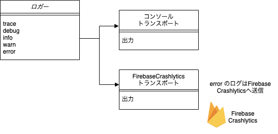

アプリケーション開発時のデバッグ用途でログが必要になります。
また、リリースした後のアプリクラッシュのような重度障害の発生に備え、エラー情報としてログを収集する必要があります。

これらの要件に対してログ機能を提供します。

## アプリのログ管理の仕組み

ログ出力を行うには、図のようにロガークラスを用いて、InfoやWarnなどのログレベルごとのAPIを呼び出します。

1. ロガークラスは、出力先を切り替えるトランスポートを複数持てます。
2. コンソールに出力するトランスポートと、エラーをFirebase Crashlyticsに出力するトランスポートがあります。

モバイルアプリでクラッシュが発生した場合は、Firebase Crashlytics向けに出力されたログが原因解析のため次の起動時にFirebase Crashlyticsのサーバに送信されます。

## 関連する決定事項

- [ログ出力の方針](../../decisions/adr-006-logging)
