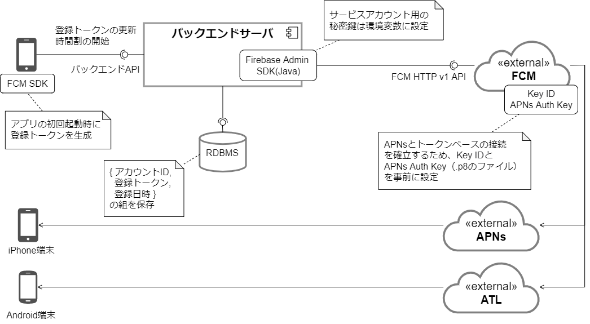

## Push 通知の全体像

### デバイス登録トークンの管理

- アカウントID、登録トークン、登録日時の組を保存
- アカウントのログインやログアウト、Push通知送信エラー時に更新される
- Push通知はアカウントに紐づく全デバイスに送信

### FCMの設定

- APNs Auth Keyの設定について
- FCMの料金とか情報は必要？

### バックエンドサーバの設定

- サービスアカウント用の秘密鍵は環境変数に保持

### バックエンドサーバとFCMとの連携

- デバイス指定での送信
- 送信効率のためマルチキャスト送信。500件単位に分割して送信。
- FCMから無効なトークンのエラー応答（UNREGISTERD）が返ってきた場合は登録トークンをデータベースから削除

## 関連する決定事項

- [プッシュ通知方式の方針](../../decisions/adr-008-push-notification.mdx)
- [FCM を用いたプッシュ通知の管理方針](../../decisions/adr-009-push-notification-fcm.mdx)
- [プッシュ通知の内容に関する方針](../../decisions/adr-010-push-notification-contents.mdx)
