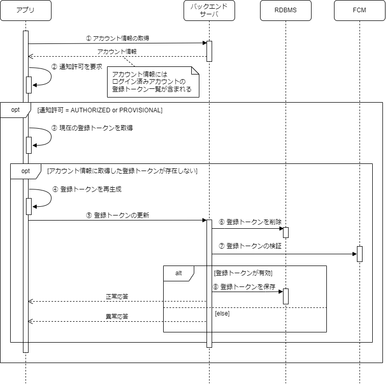

## 処理フロー

処理フロー図とそれぞれの処理の説明。

- Push通知の許可はサインアップ時
  - 1度だけ許可を確認できる
  - AndroidはAPIを呼び出しても常に成功
- アプリ初回起動時に登録トークンが作成
- ログイン時に登録トークンを登録
- 登録トークンの更新について
- 通知許可の確認ダイアログの表示タイミングについて
- 登録トークンの検証について（validate_onlyのパラメータをtrue）
