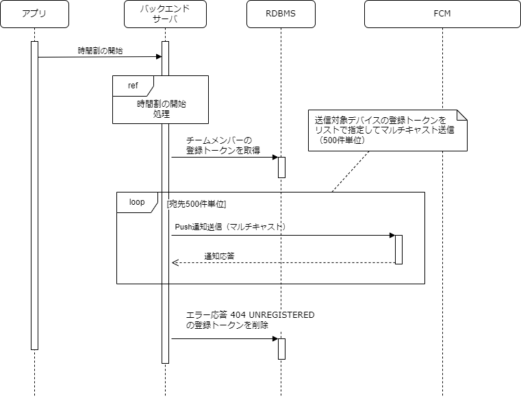

## 処理フロー

処理フロー図とそれぞれの処理の説明。

## 送信情報

- 送信情報に指定する内容について
- パラメータ指定しなかった場合はデフォルト

- 時間割の開始通知の送信情報について
  - 通知表示内容：タイトルと本文のみ
  - 時間割の開始通知を表す通知タイプと、チームID・時間割IDのパラメータ
  - 優先度：高
  - 有効期限：12時間
  - 折りたたみ：アプリ単位で集約（デフォルト）
  - その他の設定：デフォルト

## レート制限

## エラーハンドリング

- FCMから無効なトークンのエラー応答（UNREGISTERD）が返ってきた場合は登録トークンをデータベースから削除
