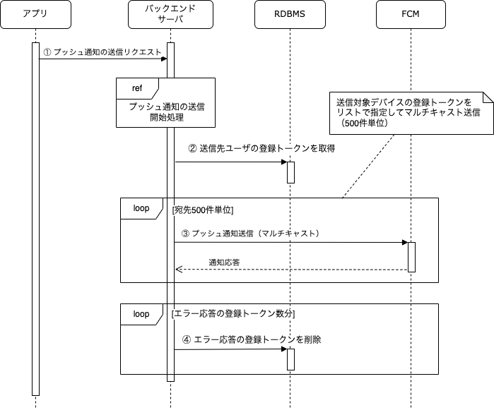

バックエンドサーバがFCMと連携することでプッシュ通知を送信します。
ここでは時間割の開始を例に挙げて、プッシュ通知送信の処理フローを説明します。

## 処理フロー

プッシュ通知送信の処理フローは以下になります。

| No | 処理 | 内容 |
|:--|:--|:--|
| ① | 時間割の開始 |  アプリが時間割の開始APIを呼び出します。このAPI呼び出しにより、チームの当日の時間割を開始し、チームメンバーにその旨をプッシュ通知します |
| ② | チームメンバーの登録トークンを取得 | チームメンバーのアカウントに紐づく登録トークンを取得します。アカウントに紐づく登録トークンが複数ある場合、その全てが通知対象となります。|
| ③ | プッシュ通知送信（マルチキャスト） | マルチキャスト送信を用いて複数の宛先へ同時にメッセージを送信します。マルチキャスト送信は1回のリクエストで最大500件までのメッセージを送信できます。宛先が500デバイスを超える場合は、複数回のリクエストに分けて送信します。 |
| ④ | エラー応答の登録トークンを削除 | 通知の送信時にUNREGISTERDのエラーを受け取った場合、無効な登録トークンとして判断し、データベースから削除します。|

## 送信情報

このアプリでは、以下のユースケースそれぞれに対して以下の内容のプッシュ通知を送信します。

- 時間割の開始通知
  - 通知表示内容：タイトルと本文のみ
  - 通知に含めるデータ：時間割の開始通知を表す通知タイプと、チームID・時間割IDのパラメータ
  - 優先度：高（スリープ状態を解除する）
  - 有効期限：12時間
  - 折りたたみ：アプリ単位で集約（デフォルト）
  - その他の設定：デフォルト

各送信内容の詳細は、[プッシュ通知の内容に関する方針](../../decisions/adr-010-push-notification-contents.mdx)を参照してください。

## 送信処理の非同期制御

プッシュ通知の送信はその特性や効率性、およびエラー発生時の再送制御を考慮し、本来であれば非同期で実装するのが望ましいです。
このアプリでは、クライアント側となるモバイルアプリのサンプルを充実させることに注力しているため、 今回は同期処理でプッシュ通知を実装します。

## エラー発生時の処理

このアプリでは、クライアント側となるモバイルアプリのサンプルを充実させることに注力しているため、 エラー発生時の再送制御は実装しないものとします。
詳細は、[FCMを用いたプッシュ通知の管理方針のエラーハンドリング](../../decisions/adr-009-push-notification-fcm.mdx#エラーハンドリング)を参照してください。
