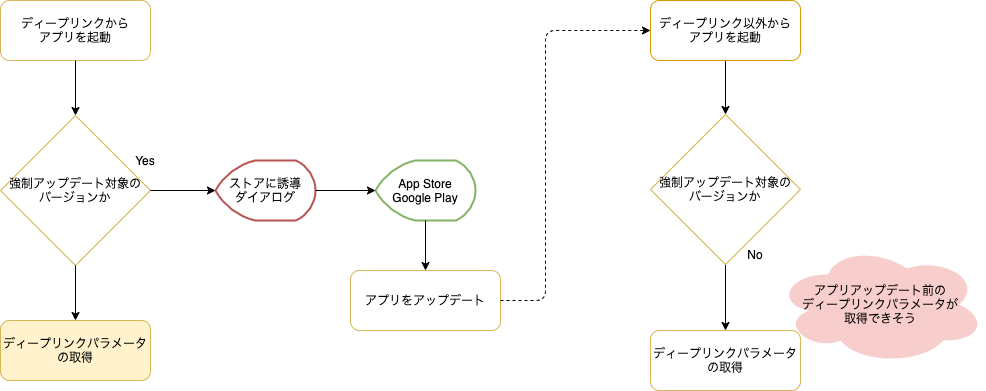
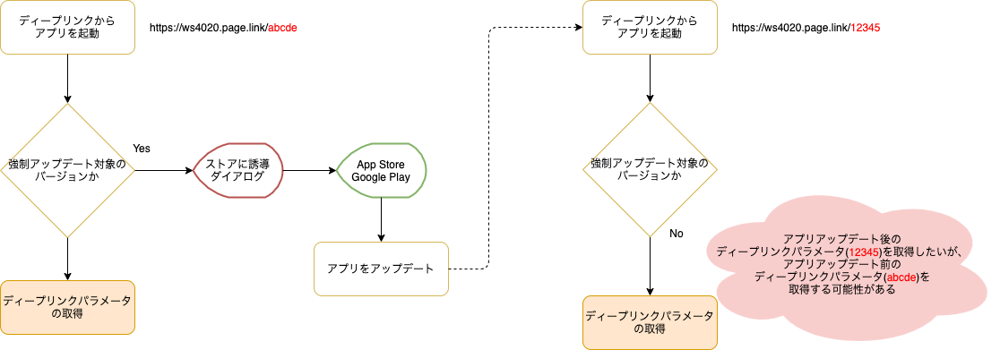
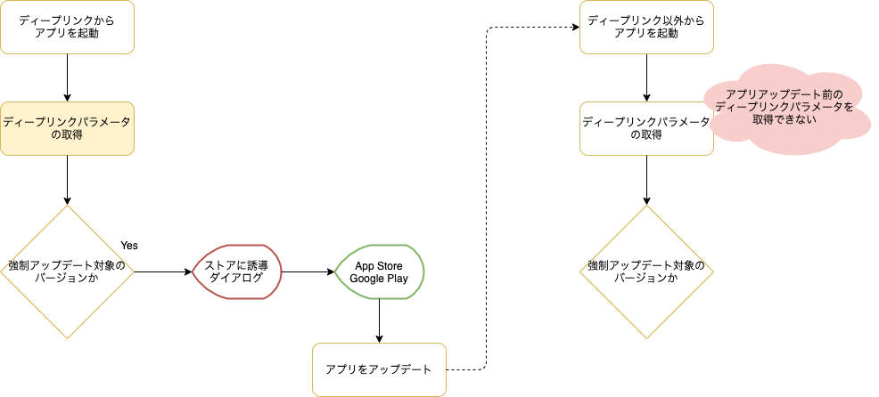
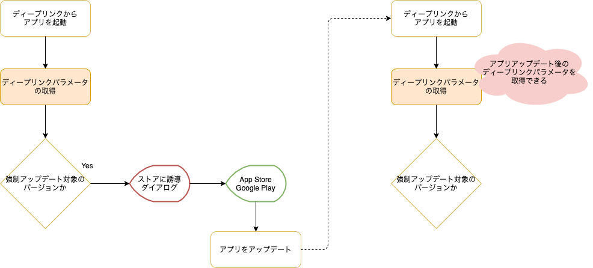

Status: Accepted

<!--
Proposed: 提案中
Accepted: 採用
Rejected: 却下
Superseded: 廃止
-->

## 要約

Push通知やディープリンクのパラメータ取得処理は、アプリ起動直後に実施する。

## コンテキスト

SantokuAppでは、アプリ起動後の初期化処理として以下を実施します。

1. 強制アップデート対象のバージョン確認
1. キャッシュの削除
1. 初期データの取得
1. 初期表示画面の決定

これらに加えて、通知領域に表示されたメッセージをタップしてアプリを起動した場合やディープリンクから起動した場合は、Push通知とディープリンクのパラメータを取得する必要があります。SantokuAppでは、Push通知やディープリンクパラメータに応じて初期表示する画面を決定するためです。

しかし、Push通知やディープリンクに含まれるパラメータは、初期化処理の中のどのタイミングで取得するのが良いかという議論が挙がりました。
そのため、ここではPush通知とディープリンクのパラメータの取得を、初期化処理のどのタイミングで実施するかについて検討していきます。

なお、前提としてPush通知はFirebase Cloud Messagingを使用し、ディープリンクはFirebase Dynamic Linksを使用します。ライブラリは、React Native Firebaseを使用します。

## 議論

SantokuAppでは、アプリ起動後の初期化処理でPush通知やディープリンクパラメータに応じて初期表示する画面を決定します。そのため、少なくとも「初期表示画面の決定」よりは先にPush通知やディープリンクに含まれるパラメータを取得する必要があります。

次に、「ディープリンクのパラメータは強制アップデート対象のバージョン確認の前後どちらで実施するのが良いのか」という疑問が沸きました。

Firebase Dynamic LinksとSantokuAppは以下の特徴を持っています。起動したアプリが強制アップデート対象の場合は、アプリアップデートの前にディープリンクパラメータを取得するかどうかで、アプリアップデート後に取得できるディープリンクパラメータが変わると考えたからです。

- Firebase Dynamic Linksでは、アプリがディープリンクイベント（ディープリンクからアプリを起動）を取得するまでペンディング状態として保管する
- Firebase Dynamic Linksでは、アプリがディープリンクイベント（ディープリンクからアプリを起動）を取得できるのは1度だけである
- SantokuAppでは、起動したアプリが強制アップデート対象の場合、App StoreやGoogle Playに誘導するダイアログを表示して、以降の初期化処理を実施しない

以降では、「強制アップデート対象のバージョン確認」の前後でディープリンクパラメータを取得した場合のフローを確認しながら比較していきます。

### 「強制アップデート対象のバージョン確認」の後にディープリンクパラメータを取得

起動したアプリが強制アップデート対象の場合、アプリアップデート後にディープリンク以外から再度アプリを起動するとアプリアップデート前のディープリンクパラメータを取得できそうです。

#### アプリをアップデート後、ディープリンク以外からアプリを起動する場合のフロー

しかし、アプリアップデート後にディープリンクから再度アプリを起動すると、アプリアップデート前のディープリンクパラメータを取得してしまう可能性があります。Firebase Dynamic Linksは、アプリがディープリンクパラメータを取得するまでペンディング状態として保管するためです。

#### アプリをアップデート後、ディープリンクからアプリを起動する場合のフロー

アプリアップデート前のディープリンクパラメータを取得するのは、ユーザを困惑させる原因となります。

### 「強制アップデート対象のバージョン確認」の前にディープリンクパラメータを取得

起動したアプリが強制アップデート対象の場合、アプリアップデート後にディープリンク以外から再度アプリを起動するとアプリアップデート前のディープリンクパラメータを取得できません。アプリのアップデート前に、ディープリンクパラメータを取得しているためです。

<!-- markdownlint-disable MD024 -->

#### アプリをアップデート後、ディープリンク以外からアプリを起動する場合のフロー

<!-- markdownlint-enable MD024 -->

アプリアップデート後にディープリンクからアプリを起動した場合は、アプリアップデート後のディープリンクパラメータを取得できます。

<!-- markdownlint-disable MD024 -->

#### アプリをアップデート後、ディープリンクからアプリを起動する場合のフロー

<!-- markdownlint-enable MD024 -->

### 結論

SantokuAppでは、想定していないディープリンクパラメータを取得するのはユーザを困惑させる原因になると考え、「強制アップデート対象のバージョン確認」の前に実施する方針とします。
アプリアップデート後にディープリンク以外から再度アプリを起動した場合、アプリアップデート前のディープリンクパラメータを取得できない事象は、SantokuAppの制限事項とします。

なお、Push通知のパラメータ取得に関してもディープリンクと同様に考え、「強制アップデート対象のバージョン確認」の前に実施する方針とします。

## 決定

アプリ起動後の初期化処理は、以下の順に実施する。

1. Push通知やディープリンクのパラメータ取得
1. 強制アップデート対象のバージョン確認
1. キャッシュの削除
1. 初期データの取得
1. 初期表示画面の決定
