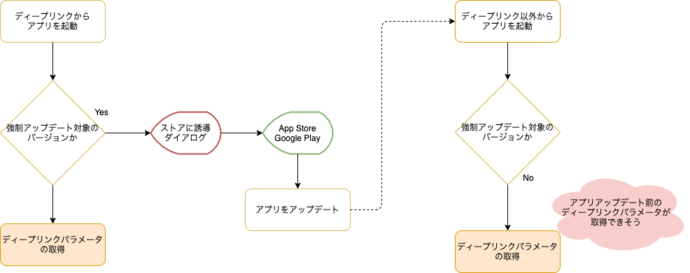

Status: Accepted

<!--
Proposed: 提案中
Accepted: 採用
Rejected: 却下
Superseded: 廃止
-->

## 要約

Push通知やディープリンクのパラメータ取得処理は、アプリ起動直後に実施する。

## コンテキスト

SantokuAppでは、アプリ起動後の初期化処理として以下を実施します。

1. 強制アップデート対象のバージョン確認
1. キャッシュの削除
1. 初期データの取得
1. 初期表示画面の決定

これらに加えて、通知領域に表示されたメッセージをタップしてアプリを起動した場合やディープリンクから起動した場合は、Push通知とディープリンクのパラメータを取得する必要があります。SantokuAppでは、Push通知やディープリンクをトリガーとしてアプリを起動した場合、それらに含まれるパラメータに応じて初期表示する画面を決定するためです。

しかし、Push通知やディープリンクに含まれるパラメータは、初期化処理の中のどのタイミングで取得するのが良いかという議論が挙がりました。
そのため、ここではPush通知とディープリンクのパラメータの取得を、初期化処理のどのタイミングで実施するかについて検討していきます。

なお、前提としてPush通知はFirebase Cloud Messagingを使用し、ディープリンクはFirebase Dynamic Linksを使用します。ライブラリは、React Native Firebaseを使用します。

## 議論

SantokuAppでは、Push通知やディープリンクに含まれるパラメータに応じて初期表示する画面を決定します。そのため、少なくとも「初期表示画面の決定」よりは先にPush通知やディープリンクに含まれるパラメータを取得する必要があります。

次に、ディープリンクのパラメータは「強制アップデート対象のバージョン確認」の前後どちらかで実施するのが良いのではないかという意見が挙がりました。そこで、「強制アップデート対象のバージョン確認」の前後で実施した場合に違いがあるか比較していきます。

### 「強制アップデート対象のバージョン確認」の後にディープリンクパラメータを取得

起動したアプリが強制アップデート対象の場合、SantokuAppではApp StoreやGoogle Playに誘導するダイアログを表示して、以降の初期化処理を実施しません。ディープリンクパラメータの取得処理を実施しないため、アプリアップデート後にディープリンク以外からアプリを再度起動した場合、アプリアップデート前のディープリンクのパラメータを取得できるのではないかと考えました。

#### アプリをアップデート後、ディープリンク以外からアプリを起動

しかし、上記の場合はアプリのアップデート後に再度ディープリンクからアプリを起動すると、アプリアップデート前のディープリンクパラメータを取得してしまう可能性があります。Firebase Dynamic Linksは、アプリがディープリンクパラメータを取得するまでペンディング状態として保存するためです。

#### アプリをアップデート後、ディープリンクからアプリを起動

### 「強制アップデート対象のバージョン確認」の前にディープリンクパラメータを取得

「強制アップデート対象のバージョン確認」の前にディープリンクパラメータを取得した場合は、アプリアップデート後にディープリンク以外からアプリを起動するとアプリアップデート前のディープリンクパラメータを取得できません。アプリのアップデート前に、ディープリンクパラメータを取得しているためです。

#### アプリをアップデート後、ディープリンク以外からアプリを起動

その反面、アプリアップデート後にディープリンクからアプリを起動した場合は、アプリアップデート後のディープリンクパラメータを取得できます。

#### アプリをアップデート後、ディープリンクからアプリを起動

### 結論

SantokuAppでは、想定していないディープリンクパラメータを取得するのはユーザを困惑させる原因になると考え、「強制アップデート対象のバージョン確認」の前に実施する方針とします。

なお、Push通知のパラメータ取得に関してもディープリンクと同様に考え、「強制アップデート対象のバージョン確認」の前に実施する方針とします。

## 決定

アプリ起動後の初期化処理は、以下の順に実施する。

1. Push通知やディープリンクのパラメータ取得
1. 強制アップデート対象のバージョン確認
1. キャッシュの削除
1. 初期データの取得
1. 初期表示画面の決定
