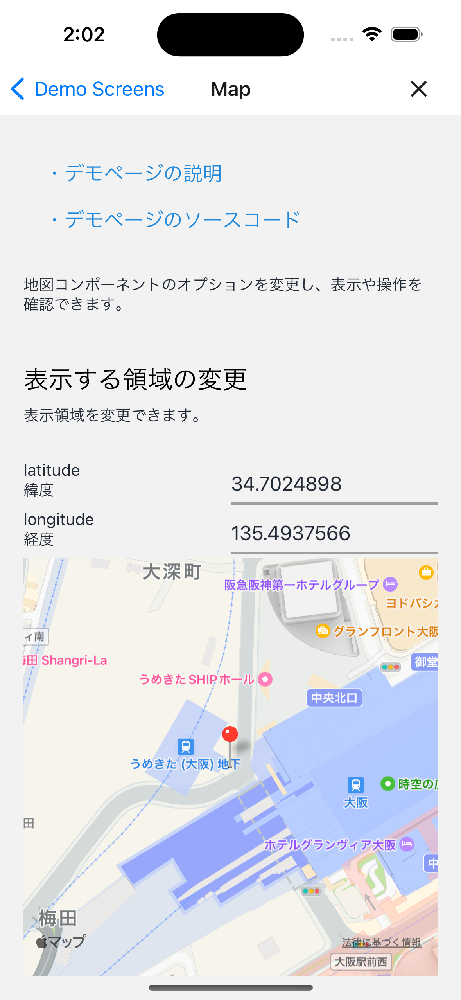

# 地図表示

## 概要

地図表示を検証するデモページです。

このページのソースコードは[こちら](https://github.com/{@inject:organization}/mobile-app-crib-notes/tree/master/example-app/SantokuApp/src/features/demo-map)です。

## 検証できること

### 表示領域の変更

表示位置と表示範囲を変更できます。

- latitude: 緯度
- longitude: 経度
- latitudeDelta: 緯度範囲（縦幅）
- longitudeDelta: 経度範囲（横幅）

地図の表示領域内にlatitudeDeltaとlongitudeDeltaで指定した範囲の両方が収まるように地図が表示されます。

### 地図の種類選択

地図の見た目を変更できます。

- MapType: 地図タイプ
  - standard: 道路地図
  - satelite: 航空写真
  - hybrid: 航空写真に道路地図を重ねたもの

### 画面操作の制限

以下の画面操作を制限できます。

- scrollEnabled: スクロールを許可
- zoomEnabled: 拡大縮小を許可
- rotateEnabled: 回転を許可
- pitchEnabled: 俯瞰視点の角度変更を許可

### TODO マーカーの追加

以下の項目に値を指定しマーカーを追加できます。

- latitude: 緯度
- longitude: 経度
- title: タイトル
- description: 説明
- dragable: ドラックアンドドロップによる位置変更を許可

タイトルと説明を両方入力しなかった場合、タップしてもコールアウトは表示されません。

## 使用したマップSDK

地図表示のためにreact-native-mapsを使用します。
react-native-mapsで使用できるマップSDKは、iOSが[MapKit](https://developer.apple.com/documentation/mapkit/)あるいは[Googleマップ](https://developers.google.com/maps/documentation/ios-sdk?hl=ja)、Androidは[Googleマップ](https://developers.google.com/maps/documentation/android-sdk?hl=ja)のみになります。
[地図表示の共通部品](https://github.com/Fintan-contents/mobile-app-crib-notes/blob/master/example-app/SantokuApp/src/bases/ui/map/MapView.tsx)ではiOSでGoogleマップの使用を制限しています。
そのため、このページではiOSはMapKit、AndroidはGoogleマップを使用した地図表示を実装しています。

### AndroidでGoogleマップを使用する場合に必要な設定

GoogleマップAPIを使用するためのAPIキーが必要になります
公開しているソースコードではダミーのAPIキーを`app.config.js`に設定しています。

Googleマップを使用する場合は、以下を参考にAPIキーを取得してください。

- [APIキーを使用する | Map SDK for Android | Google Developers](https://developers.google.com/maps/documentation/android-sdk/get-api-key?hl=ja)

`app.config.js`のダミーのAPIキーを取得したキーに置き換えてください。

```diff title="/app.config.js"
module.exports = ({config}) => {
  const environment = process.env.ENVIRONMENT ?? 'prod';
  const defaultAppConfig = {
    /* ～省略～ */
    android: {
      /* ～省略～ */
      config: {
        googleMaps: {
-         apiKey: 'dummyApiKey',
+         apiKey: '<Your API Key>',
        },
      },
    },
/* ～省略～ */
```

- [app.json / app.config.js - Expo Documentation](https://docs.expo.dev/versions/latest/config/app/#googlemaps)

### iOSでGoogleマップを使用するときの注意点

地図表示の共通部品ではiOSでGoogleマップを使うことはできない仕様になっています。
iOSでGoogleマップを使用する場合、共通部品は使用せずライブラリからコンポーネントをインポートしてください。
さらに、設定ファイルの変更が必要になります。

Santokuアプリではfirebaseを使用しているため、useFrameworksで静的リンクを明示的に指定しています。

- [Configure Firebase with iOS credentials | React Native Firebase](https://rnfirebase.io/#altering-cocoapods-to-use-frameworks)

しかしreact-native-mapsの0.3系はuseFrameworksに対応していません。
iOSでGoogleマップを使用する設定でビルドしたとき依存関係にあるファイルが見つからないというエラーが発生します。

- ['RCTConvert+AirMap.h' file not found・Issues #3597 | GitHub](https://github.com/react-native-maps/react-native-maps/issues/3597)
- [use_frameworks! issues with react-native-maps RN 0.69.3 | GitHub](https://github.com/react-native-maps/react-native-maps/discussions/4389)

そのため['RCTConvert+AirMap.h' file not found・Issues #3597 | GitHub](https://github.com/react-native-maps/react-native-maps/issues/3597)を参考にして、`Podfile`に以下を追記してください。

```Ruby
  # https://github.com/react-native-maps/react-native-maps/issues/3597
  $static_framework = [
    'react-native-maps',
    'react-native-google-maps',
    'Google-Maps-iOS-Utils',
    'GoogleMaps',
  ]

  pre_install do |installer|
    Pod::Installer::Xcode::TargetValidator.send(:define_method, :verify_no_static_framework_transitive_dependencies) {}
        installer.pod_targets.each do |pod|
            if $static_framework.include?(pod.name)
                def pod.build_type;
                Pod::BuildType.static_library # >= 1.9
            end
        end
    end
  end
```

## 地図表示のイメージ

| iOS | Android |
|:--|:--|
|||
