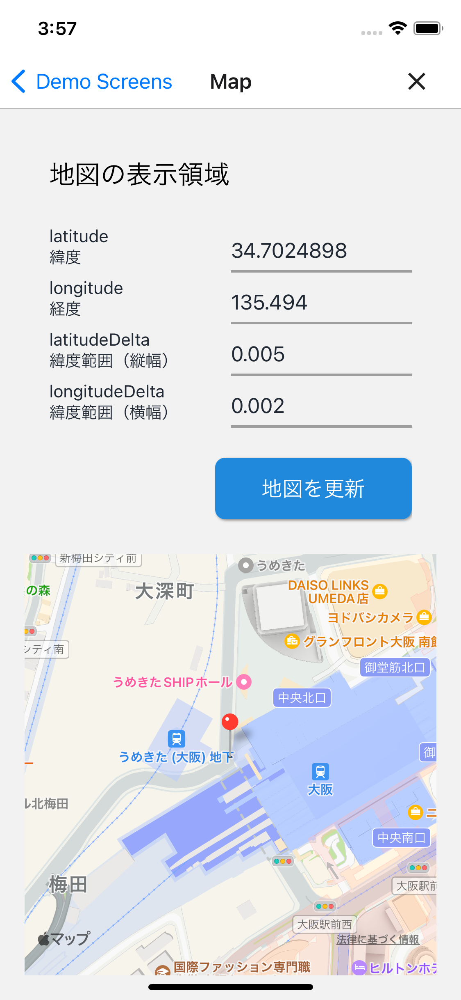
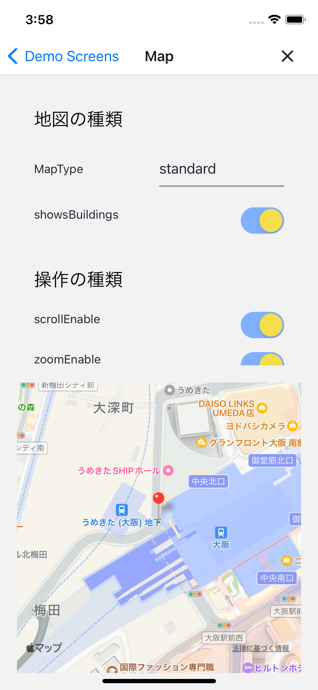

# マップ表示

## 概要

マップ表示を検証するデモページです。

  

このページのソースコードは[こちら](https://github.com/{@inject:organization}/mobile-app-crib-notes/tree/master/example-app/SantokuApp/src/features/demo-map)です。

## 検証できること

### 表示領域の変更

以下の項目に数値を入力し表示領域を変更できます。

- latitude: 緯度
- longitude: 経度
- latitudeDelta: 緯度範囲
- longitudeDelta: 経度範囲

### 地図の種類選択

以下の項目を設定し地図の見た目を変更できます。

- MapType: マップタイプ
  - standard: 道路地図
  - satelite: 航空写真
  - hybrid: 航空写真に道路地図を重ねたもの

### 画面操作の制限

以下の項目の画面操作を制限できます。

- scrollEnabled: スクロール操作による表示位置の移動
- zoomEnabled: ピンチイン・ピンチアウト操作とダブルタップによる拡大縮小
- rotateEnabled: 2本指スワイプによる回転
- pitchEnabled: 2本指縦方向スワイプによる俯瞰視点の角度変更

### TODO マーカーの追加

以下の項目に値を指定しマーカーを追加できます。

- latitude: 緯度
- longitude: 経度
- title: タイトル
- description: 説明
- dragable: ドラックアンドドロップによる位置変更を許可

タイトルと説明を両方入力しなかった場合、タップしてもコールアウトは表示されません。

## 使用したマップSDK

地図表示のためにreact-native-mapsを使用します。
react-native-mapsで使用できるマップSDKは、iOSが[MapKit](https://developer.apple.com/documentation/mapkit/)あるいは[Google Map](https://developers.google.com/maps/documentation/ios-sdk?hl=ja)、Androidは[Google Map](https://developers.google.com/maps/documentation/android-sdk?hl=ja)のみになります。
マップ表示の共通部品ではiOSでGoogle Mapの使用を制限しています。
そのため、このページではiOSはMapKit、AndroidはGoogle Mapを使用した地図表示を実装しています。

### AndroidでGoogle Mapを使用する場合に必要な設定

Google Maps APIが必要になります。
公開しているソースコードではダミーのAPIキーを`app.config.js`に設定しています。

Google Mapを使用する場合は、以下を参考にAPIキーを取得してください。

- [Google Map Platform API キーを使用する（Android）| Google Maps Platform](https://developers.google.com/maps/documentation/android-sdk/get-api-key?hl=ja)

以下を参考に`app.config.js`のダミーのAPIキーを取得したキーに置き換えてください。

```diff title="/app.config.js"
module.exports = ({config}) => {
  const environment = process.env.ENVIRONMENT ?? 'prod';
  const defaultAppConfig = {
    /* ～省略～ */
    android: {
      /* ～省略～ */
      config: {
        googleMaps: {
-         apiKey: 'dummyApiKey',
+         apiKey: '<Your API Key>',
        },
      },
    },
/* ～省略～ */
```

- [Google Maps API key in app.json / app.config.js (Android) | Expo](https://docs.expo.dev/versions/latest/config/app/#googlemaps)

### iOSでGoogle Mapを使用するときの注意点

マップ表示の共通部品ではiOSでGoogle mapを使うことはできない仕様になっています。
iOSでgoogle mapを使用する場合、共通部品は使用せずライブラリから直接コンポーネントをインポートしてください。
さらに、以下を参考に設定ファイルの変更が必要になります。

Santokuアプリではfirebaseを使用しているため、useFrameworksで静的リンクを明示的に指定しています。

- [Configure Firebase with iOS credentials | React Native Firebase](https://rnfirebase.io/#altering-cocoapods-to-use-frameworks)

しかしreact-native-mapsの0.3系はuseFrameworksに対応していません。
iOSでGoogle Mapを使用する設定でビルドしたとき依存関係にあるファイルが見つからないというエラーが発生しました。

- ['RCTConvert+AirMap.h' file not found | GitHub](https://github.com/react-native-maps/react-native-maps/issues/3597)
- [use_frameworks! issues with react-native-maps RN 0.69.3 | GitHub](https://github.com/react-native-maps/react-native-maps/discussions/4389)

そのため['RCTConvert+AirMap.h' file not found | GitHub](https://github.com/react-native-maps/react-native-maps/issues/3597)を参考にして、`Podfile`に以下を追記してください。

```Ruby
  # https://github.com/react-native-maps/react-native-maps/issues/3597
  $static_framework = [
    'react-native-maps',
    'react-native-google-maps',
    'Google-Maps-iOS-Utils',
    'GoogleMaps',
  ]

  pre_install do |installer|
    Pod::Installer::Xcode::TargetValidator.send(:define_method, :verify_no_static_framework_transitive_dependencies) {}
        installer.pod_targets.each do |pod|
            if $static_framework.include?(pod.name)
                def pod.build_type;
                Pod::BuildType.static_library # >= 1.9
            end
        end
    end
  end
```
