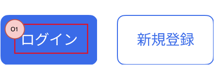

## 概要

このアプリ内で、ユーザが押下できるボタンを提供するコンポーネントです。

## 機能

- ボタンはPrimary filledとPrimary outlinedの2種類を、用途に応じて使い分けることができます。
- タップ時にはハイライト表示をします。
- ユーザがタップできないよう、非活性化できます。非活性になった場合、ユーザがわかるようにボタンの色を変更します。
- ボタン内のメッセージは、外部から指定できます。
- ボタンがタップされた時の処理を、外部から指定できます。
- ボタン内でインジケータを表示できます。インジケータ表示中はメッセージが非表示になり、ユーザがタップできないように非活性化します。
- メッセージとインジケータの表示切替は、外部から指定できます。

## イメージ

## 入力項目

なし。

## 表示項目

| 番号 | 名称          | 項目種別    | 取得元               | 表示/活性条件                                 |
|:----|:--------------|:-----------|:--------------------|:--------------------------------------------|
| O1  | メッセージ      | ラベル     | -（※1）               |                                            |
（※1）呼び出し元から渡す。

## 操作項目

※このコンポーネント自体がボタンであり、タップできることが明白なため割愛する。

## イベント定義

- 初期表示、フォーカスが当たる
  - 指定されたメッセージを表示します。
  - インジケータ表示の指定がある場合は、インジケータを表示します。
- ボタンをタップ
  - 指定された処理がある場合、処理を実行します。
- インジケータの表示ON
  - メッセージを非表示にして、インジケータを表示します。
  - インジケータ表示中はボタンを非活性化し、タップできないようにします。
- インジケータの表示OFF
  - インジケータを非表示にして、メッセージを表示します。
  - ボタンを活性化し、タップできるようにします。

## エラー発生時の処理

なし。

## 備考

なし。
