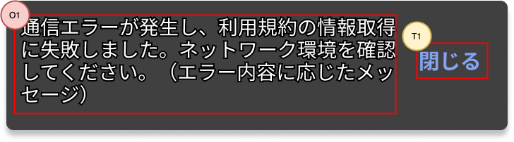

## 概要

このアプリ内で、短いメッセージを表示する際に使用するコンポーネントです。

## 機能

- 指定されたメッセージを、画面下部に表示します。
- 表示から一定時間が経過したら自動で閉じます。表示時間はメッセージに応じて変更できます。
- 表示時間を過ぎていなくても、ユーザ操作によって明示的に閉じることができます。
- 表示できるメッセージは4行までとします。超過する場合は、行末を「...」で省略します。

## イメージ

## 入力項目

なし。

## 表示項目

| 番号 | 名称          | 項目種別    | 取得元               | 表示/活性条件                                 |
|:----|:--------------|:-----------|:--------------------|:--------------------------------------------|
| O1  | メッセージ      | ラベル     | -（※1）               |                                            |
（※1）呼び出し元から渡します。

## 操作項目

| 番号 | 名称        | 項目種別    | 操作種別   | 発生するイベント   | 表示/活性条件                               |
|:----|:------------|:-----------|:----------|:----------------|-------------------------------------------|
| T1  | 閉じる       | TouchableOpacity | タップ | スナックバーを閉じる |                                           |

## イベント定義

- 初期表示
  - 指定されたメッセージを表示します。
  - 一定時間を経過したら閉じます。
- スナックバーを閉じる
  - スナックバーをすぐに閉じます。

## エラー発生時の処理

なし。

## 備考

なし。
