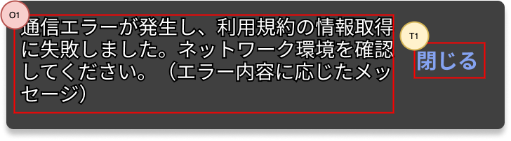

## 概要

スナックバーは、ユーザにメッセージを通知するコンポーネントです。画面下部に表示され、一定時間が経過すると自動的に消えます。

## 機能

- 指定されたメッセージを、画面下部に表示します。
- 表示から一定時間が経過したら自動で閉じます。表示時間はデフォルトでは4秒です。ただし、スナックバーを表示する際に、表示時間の指定もできます。
- 表示時間を過ぎていなくても、ユーザ操作によって閉じることもできます。
- 任意の表示位置を指定できます。
- 任意のスタイルを指定できます。
- 任意のアクションを指定できます。アクションを指定すると、メッセージ横にボタンが表示されます。

## イメージ

## 入力項目

なし。

## 表示項目

| 番号 | 名称          | 項目種別    | 取得元               | 表示/活性条件                                 |
|:----|:--------------|:-----------|:--------------------|:--------------------------------------------|
| O1  | メッセージ      | ラベル     | -（※1）               |                                            |
| O2  | アクションボタン  | ボタン      | -（※2）              | プロパティ：actionTextとactionHandlerが指定されている場合のみ表示 |
（※1）プロパティ：messageで任意の文字列を指定できます。 
（※2）プロパティ：actionTextで任意の文字列を指定できます。

## 操作項目

| 番号 | 名称        | 項目種別    | 操作種別   | 発生するイベント   | 表示/活性条件                               |
|:----|:------------|:-----------|:----------|:----------------|-------------------------------------------|
| T1  | アクションボタン | ボタン    | タップ    | -（※1）| プロパティ：actionTextとactionHandlerが指定されている場合のみ表示 |
（※1）プロパティ：actionHandlerで任意の処理を指定できます。

## イベント定義

- 初期表示
  - 指定されたメッセージを表示します。
  - 一定時間を経過したら閉じます。

## プロパティ

| 名称           | 必須 | 型     | 説明                                                   |
|:--------------|:-----|:-------|:------------------------------------------------------|
| message       | ○    | string | メッセージに表示する文字列                                |
| messageTextStyle       | -    | TextStyle（※1）| メッセージに表示する文字列のスタイル        |
| style       | -    | [ViewStyle][] | スナックバーのスタイル                               |
| animatedContainerStyle       | -    | [ViewStyle][] | スナックバー外周のスタイル 表示位置などはこちらで指定します |
| actionText       | -    | string | アクションボタンに表示する文字列                       |
| actionHandler       | -    | function | アクションボタンタップ時の処理            |
| actionTextStyle       | -    | [TextStyle][] | アクションボタンに表示する文字列のスタイル           |
| autoHideDuration       | -    | number | 表示してから自動で閉じるまでの秒数（ミリ秒） デフォルトは4000ms   |
| fadeInDuration       | -    | number | 表示する際のフェードイン演出の速度（ミリ秒） デフォルトは1000ms                         |
| fadeOutDuration       | -    | number | 自動で閉じる際のフェードアウト演出の速度（ミリ秒） デフォルトは1000ms                    |
| forceFadeOutDuration       | -    | number | 強制的に閉じる際のフェードアウト演出の速度（ミリ秒） デフォルトは300ms              |
| hide       | -    | boolean | スナックバーを強制的に閉じるフラグ trueにすると、強制的に閉じます |
| hideFadeOutDuration       | -    | number | 強制的に閉じる際のフェードアウト演出の速度（ミリ秒） 閉じる際の演出速度を個別に変えたい場合に使用します。指定がない場合はforceFadeOutDurationが有効になります。 |

## エラー発生時の処理

なし。

## スナックバーの複数表示について

- 複数のスナックバーを同時に表示できません。
- スナックバー表示中に新たなスナックバーを表示する場合、表示中のスナックバーをフェードアウトしてから新しいスナックバーを表示します。
  - この場合、先に表示していたスナックバーは表示時間を経過していなくてもフェードアウトします。

## このアプリ内の共通動作

このアプリでスナックバーを使用する場合、アクションボタンのプロパティ：actionTextとactionHandlerには以下の指定を多用します。そのため、画面個別での実装ではなく、どの画面からでも使えるよう共通化します。

| プロパティ      | 型       | 値/処理                                             |
|:--------------|:---------|:---------------------------------------------------|
| actionText    | string   | 閉じる                                              |
| actionHandler | function | スナックバーを閉じる                                  |

<!-- link定義を使う場合は以下に記載する -->
[ViewStyle]: https://reactnative.dev/docs/view-style-props
[TextStyle]: https://reactnative.dev/docs/text-style-props
