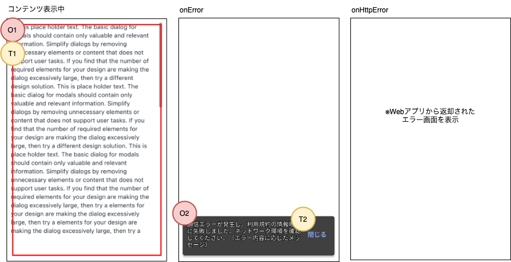

## 概要

このアプリ内で、外部のWebサイトやコンテンツを表示する際に使用するコンポーネントです。 
[React Native WebView](https://github.com/react-native-webview/react-native-webview)を使用し、共通部品として作成します。

## 機能
- 指定されたURLのコンテンツを表示します。
- エラーハンドリングは、[Application Architecture](/react-native/santoku/application-architecture/webview/webview-error-handling)に準拠します。
  - onError/onHttpError発生時の挙動は、画面に応じて変更できます。 
    表示するコンポーネント、または処理を親画面から指定できます。
- onError発生時には、デフォルトでネットワークの確認を促すメッセージをスナックバーで表示します。 
  スナックバーに表示するメッセージは、親画面から変更できます。
- コンテンツが最底部までスクロールした時の処理を、親画面でハンドリングできます。

## イメージ

※ onErrorとonHttpError時の画面は、親画面から変更可能です。変更がある場合は、個別の画面設計書の方に記載します。

## 入力項目
なし。

## 表示項目

| 番号 | 名称          | 項目種別    | 取得元               | 表示/活性条件                                 |
|:----|:--------------|:-----------|:--------------------|:--------------------------------------------|
| O1  | URLコンテンツ   | WebView    | 外部（※1）             | コンテンツ取得に成功した場合のみ表示             |
| O2  | エラーメッセージ | Snackbar  | -（※2）             | コンテンツ取得でonErrorが呼び出された場合のみ表示 |
（※1）取得先のURLは親画面から指定する。 
（※2）親画面から指定されたメッセージがあれば、そちらを優先します。指定がなければデフォルトのメッセージを表示します。

## 操作項目

| 番号 | 名称        | 項目種別    | 操作種別   | 発生するイベント   | 表示/活性条件                               |
|:----|:------------|:-----------|:----------|:----------------|-------------------------------------------|
| T1  | URLコンテンツ | WebView    | スクロール | 最底部に到達（※1）  |                                           |
| T2  | 閉じる       | ボタン      | タップ    | スナックバーを閉じる | コンテンツ取得でonErrorが呼び出された場合のみ表示 |
（※1）コンテンツを一番下までスクロールした場合のみ発生。

## イベント定義

- 初期表示
  - 指定されたURLのコンテンツを取得します。
- 画面にフォーカスが当たる
  - 指定されたURLのコンテンツを再読込します。
- スナックバーを閉じる
  - スナックバーを非表示にします。
- 最底部に到達
  - 親画面に通知します。

## エラー発生時の挙動

エラーハンドリングは、[Application Architecture](/react-native/santoku/application-architecture/webview/webview-error-handling)に準拠するため、割愛します。 
画面個別のエラーハンドリングがある場合は、画面側の設計書に記載します。

## 備考
なし。
