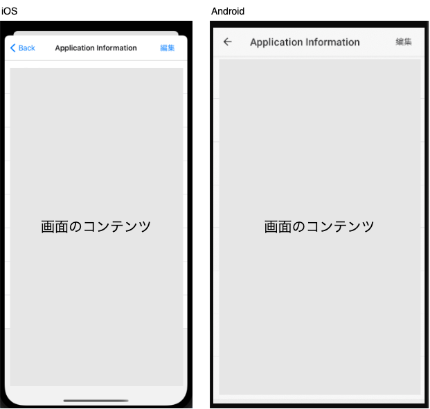

## イメージ

## ヘッダの要素

この種別では、ヘッダに以下の項目を持ちます。

- タイトル
- 右部ボタン
- 左部ボタン

:::note
ヘッダのタイトルは、OSによって表示位置に差異があります。

 - Androidの場合：左寄せ
 - iOS、またはiPad OSの場合：中央寄せ
:::

:::note
このアプリでは、ヘッダの右部ボタン/左部ボタンは、それぞれ1つのみとします。
:::

## 備考

- androidの場合は、常に全画面に表示されます。
- iOSであっても、スプラッシュスクリーン表示直後の場合は、全画面に表示されます。
