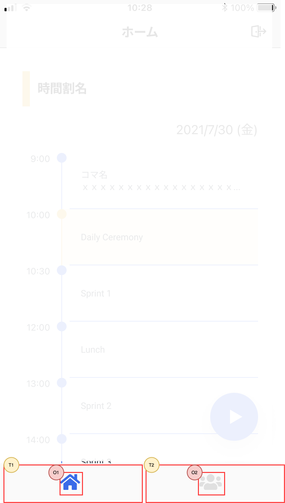

## 概要

ユーザが画面の切替を行うタブです。ログイン中の場合、常に画面下部に表示されます。

## 機能

- 切替可能な画面は以下の2つです。
  - ホーム：自チームの当日の時間割を確認ます。
  - チーム：チームの作成や参加、またチームの時間割の編集を行えます。
- タブごとに画面の遷移状況は保持します。タブを切り替えた後、再度元のタブを選択すると、切替当時に表示していた画面が表示されます。
- 選択中のタブはハイライト表示します。

:::note
ホーム/チームの画面は今後作成予定です。
:::

## イメージ

## 入力項目

なし。

## 表示項目

| 番号 | 名称          | 項目種別    | 取得元               | 表示/活性条件                                 |
|:----|:--------------|:-----------|:--------------------|:--------------------------------------------|
| O1  | ホームアイコン   | 画像       | -                   | -                                           |
| O2  | チームアイコン   | 画像       | -                   | -                                           |

## 操作項目

| 番号 | 名称        | 項目種別    | 操作種別   | 発生するイベント   | 表示/活性条件                               |
|:----|:------------|:-----------|:----------|:----------------|-------------------------------------------|
| T1  | ホームタブ    | タブ       | タップ     | ホームに切替 | -                                          |
| T2  | チームタブ    | タブ       | タップ    | チームに切替 | -                                          |

## イベント定義

- ホームに切替
  - ホームの画面に切り替えます。
  - 初めて開く場合は、ホーム画面を表示します。
- チームに切替
  - チームの画面に切り替えます。
  - 初めて開く場合は、チーム詳細画面を表示します。

## エラー発生時の処理

なし。
