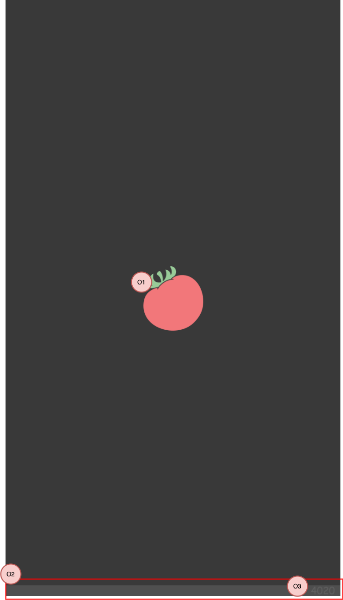

## ID

SplashScreen

## 概要

アプリの起動時（※1）に表示される画面です。

- アプリの初期化処理は、この画面の表示中に行います。初期化処理が完了するまで、次の画面には遷移しません。
- 初期化処理は以下となります。
  - ログイン済みアカウントの情報を取得する。
- 有効な利用規約に同意していない場合、利用規約同意の画面へ遷移します。
- 有効な利用規約に同意済みの場合、ホーム画面へ遷移します。
- 表示する画像は、端末サイズごとに用意します。

（※1）[アプリスタートの種類](/react-native/santoku/application-architecture/life-cycle-management/overview.mdx)の、コールドスタートとウォームスタートが該当します。

:::note
初期化処理の内容は、現在は仮のものとなります。今後、開発予定となります。
:::

## 画面種別

-（起動処理中の画面となるため、種別は定義しません）

## 画面レイアウト

## ヘッダ

なし。

## 入力項目

なし。

## 表示項目

| 番号 | 名称           | 項目種別    | 取得元               | 表示/活性条件                                 |
|:----|:--------------|:-----------|:--------------------|:--------------------------------------------|
| O1  | アプリアイコン   | 画像       | -                   | -                                          |
| O2  | フッタ          | 画像       | - |  |
| O3  | コード          | 画像       | - |  |

## 操作項目

なし。

## イベント定義

- 初期表示
  - 初期化処理を開始する。
- 初期化処理
  - ログイン済みアカウント取得APIを呼びだす。
    - APIから正常レスポンスが返却された場合、イベント：初期化処理に成功が発生。
    - APIからエラーレスポンスが返却された場合、HTTPステータスコードによって分岐します。
      - ステータスコードが403の場合、イベント：利用規約に未同意が発生。
      - ステータスコードが403以外の場合、エラー：初期化失敗が発生。
- 初期化処理に成功
  - ホーム画面に遷移する。
- 利用規約に未同意
  - 利用規約同意の画面に遷移する。

## エラー発生時の挙動

| 種別 | エラー | 発生時の挙動 |
|:----|:------|:------|
| 通信エラー    | 初期化失敗 | エラーメッセージをダイアログで表示し、ユーザにアプリ再起動を促す。 |

## 備考

なし。
