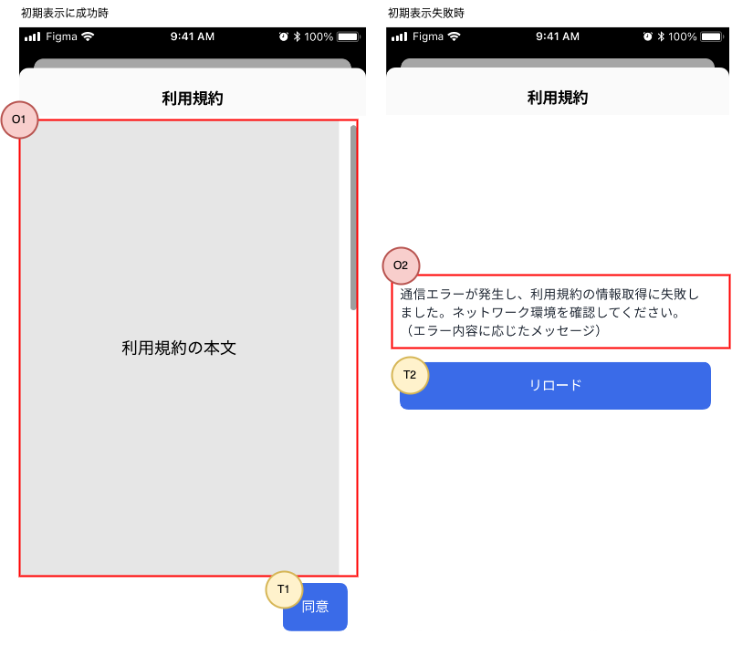

## ID

TermsOfServiceAgreement

## 概要

ユーザに利用規約を見せ、同意を求める画面です。アプリの利用には、ユーザの利用規約同意が必要です。

- ユーザは、有効な利用規約に同意する必要があります。有効な利用規約が変更された場合、ユーザに対して利用規約への同意を再度求めます。
  - 有効な利用規約に同意していない場合は、HTTP API通信でエラーとなります。[HTTP API通信で発生するエラーのハンドリング](/react-native/santoku/application-architecture/http-api/http-api-error-handling.mdx)をご参照ください。
- 利用規約は最後まで読んだ上で同意する必要があります。そのため、一度最後まで読まない限り、同意はできないようにします。
- 利用規約の本文は、外部より取得します。外部コンテンツの表示には、共通部品のWebView（TODO:リンク張る）を使用します。

## 画面種別

FormSheet（TODO:リンク張る）

## 画面レイアウト

## ヘッダ

| 位置       | 文言、ボタン  | タップ時の挙動          | 表示/活性条件                    |
|:----------|:------------|:---------------------|:--------------------------------|
| タイトル    | 利用規約     | -                    | -                              |
| 右部ボタン  | -           | -                    | -                              |
| 左部ボタン  | -           | -                    | -                              |

## 入力項目

なし。

## 表示項目

| 番号 | 名称           | 項目種別    | 取得元               | 表示/活性条件                                 |
|:----|:--------------|:-----------|:--------------------|:--------------------------------------------|
| O1  | 利用規約本文     | WebView(TODO　リンク貼る)（※1）| TODO:URLを記載     | -                                          |
| O2  | コンテンツ取得エラーメッセージ | ラベル | - | WebViewでonErrorまたはonHttpErrorが呼び出された場合のみ表示 |
| O3  | 同意エラーメッセージ | Snackbar(TODO　リンク貼る)（※1）| - | 利用規約同意でエラーが発生した場合のみ表示 |
（※1）共通部品内の表示条件等は、共通部品の仕様に準拠する。

## 操作項目

| 番号 | 名称         | 項目種別    | 操作種別  | 発生するイベント   | 表示/活性条件                  |
|:----|:------------|:-----------|:---------|:---------------|:-------------------------------|
| T1  | 同意ボタン    | ボタン      | タップ    | 利用規約に同意     | WebViewのイベント`最底部に到達`が発生したら活性化 |
| T2  | リロードボタン | ボタン      | タップ    | コンテンツ再読込   | WebViewのエラーonErrorまたはonHttpErrorが発生したら表示 |

## イベント定義

- 初期表示
  - URLを渡す。
- 画面にフォーカスが当たる
  - 利用規約本文を再読込する。（※共通部品のWebViewの仕様に準拠）
- 利用規約に同意
  - 同意ボタンにインジケータを表示し、タップできないようにする。
  - 利用規約同意APIを呼びだす。
    - APIから正常レスポンスが返却された場合、イベント：利用規約同意に成功が発生。
    - APIからエラーレスポンスが返却された場合、エラー：利用規約同意に失敗が発生。
- 利用規約同意に成功
  - ホーム画面に遷移する。
- コンテンツ再読込
  - 利用規約本文を再読込する。

## エラー発生時の挙動

| 種別 | エラー | 発生時の挙動 |
|:----|:------|:------|
| 通信エラー    | 利用規約同意に失敗 | 同意ボタンのインジケータ表示を停止する。  同意エラーメッセージを表示する。|
※WebView内で発生するエラーは、WebViewの仕様に準拠する。

## 備考

- WebViewでonErrorまたはonHttpErrorが呼び出された場合、エラーメッセージはこの画面内で個別に実装するため、 
  WebView側のSnackbarは表示しない。
