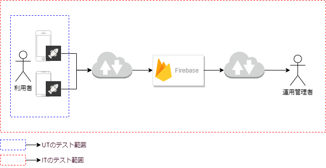

サンプルアプリケーション開発で実施する単体テストと結合テストそれぞれの実施範囲をまとめます。

## テスト実施範囲

単体テスト(UT)と結合テスト(IT)それぞれのテスト範囲は、以下の構成図の通りです。

単体テストと結合テストそれぞれで正常系と異常系のテストを実施します。
今回の開発は、サイクル毎に開発を進めていき、要件定義で定めたサンプルアプリケーションを開発していきます。
単体テストでは、単体の画面または機能に限定したレイアウトや機能確認を実施します。結合テストでは、サイクル内で開発した画面または機能および、関連するサービスを含んで網羅的なテストを実施します。
