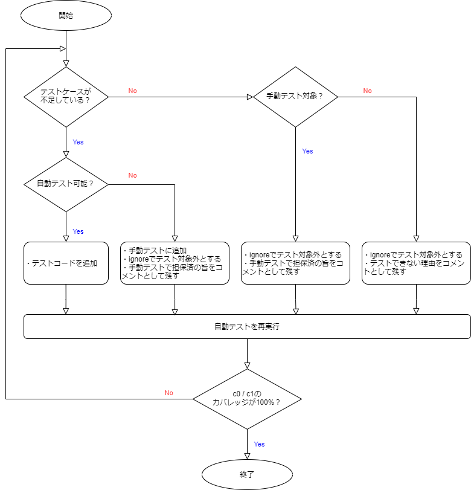

## テスト方針

単体テストでは、主に開発した画面や機能単位の動作を検証します。これにより、画面や機能単位の品質を保証することが目的となります。詳細は[全体テスト計画書のテスト方針](/react-native/santoku/test-planning/test-all-planning.mdx#テスト方針)を参照してください。

## テスト実施範囲

- 対象

  - モバイルアプリで実装した機能や画面全般
  - ただし、モバイルアプリが利用する外部サービスとの連携部分はモックサーバ、もしくはJestのモック機能を使う

- 対象外

  - バックエンド

## テスト観点

別途、[テスト観点](/react-native/santoku/test-planning/test-type/overview.mdx)がまとめられているため、そちらをベースに単体テストとしてのテスト観点を決定します。

### 対象のテスト観点

単体テストのテスト方針に基づき、画面や機能の検証に適した[機能テスト][]のテスト観点が対象になります。

- [レイアウトに関する観点][]
- [操作やイベントに関する観点](/react-native/santoku/test-planning/test-type/functional-testing/operation-event.mdx)
- [表示内容に関する観点](/react-native/santoku/test-planning/test-type/functional-testing/display-content.mdx)
- [バリデーションに関する観点](/react-native/santoku/test-planning/test-type/functional-testing/validation-check.mdx)
- [端末やOSに関する観点][]
- [ユースケースに関する観点][]

基本的には、上記観点に従います。ただし、[ユースケースに関する観点][]については、画面や機能に完結する範囲のユースケースに絞ります。複数機能の連携や、複数画面にまたがるようなユースケースについては、単体テストではなく結合テストの観点になるためです。

### 対象外のテスト観点

[構成テスト][]と[性能テスト](/react-native/santoku/test-planning/test-type/performance-test)のテスト観点は結合テストにて実施するため、対象外となります。

- 構成テストについて補足

  構成テストに挙げられているテスト観点（[レイアウトに関する観点][]や[端末やOSに関する観点][]など）は機能テストにも含まれているため、結果的に各OS1種類ずつは検証することになります。あくまで、サポート対象の端末やOSバージョンを網羅した検証は対象外ということです。

## テスト実施環境

基本的にエミュレータ／シミュレータを用いて検証します。ただし、実機でしか確認できないようなOS依存の機能（例：カメラ）については、実機を用いて検証します。

このアプリで、実機でしか確認できない機能は次のとおりです。

  - iOSのカメラ

### ビルドバリアント

使用する[ビルドバリアント](/react-native/santoku/development/build-configuration/build-variants.mdx)は、`devSantokuAppDebug`です。単体テストでは性能面の評価をしないため、デバッグ効率を重視する方針です。

### テスト端末　★作成中★

使用する端末の一覧を記載（詳細なスペックは全体計画に記載済のため、不要）

★そもそも、必要なのか。全体計画とテスト観点へのリンクと簡潔な説明で良いのでは。

## テスト方法

事前準備、自動テスト、手動テストについて記載します。

### 事前準備

単体テストの実施に必要な事前準備項目は次のとおりです。

- 単体テスト仕様書

  テスト観点を元に、開発対象の画面や機能に応じたテストケースを網羅した単体テスト仕様書を作成します。また、テスト観点に基づいて、各種テストケースの実施手段を手動テストと自動テストに分類します。

### 自動テスト

#### 自動テストの利用ツール

- 自動テスト

  テスティングフレームワークには[Jest](https://jestjs.io/ja/) 、テスト用のライブラリには[React Native Testing Library](https://callstack.github.io/react-native-testing-library/)を利用します。

#### テストコードの作成

自動テストに分類されるテストケースに基づいて、テストコードを作成します。REST APIのような外部と連携する箇所は、Jestのモック機能で対処します。

#### 自動テストの実施

`jest`コマンドで自動テストを実施します。

  ```bash
  npm run test:report
  ```

上記コマンドを実行すると、カバレッジレポートファイルが`coverage`フォルダに出力されます。`c0/c1`のカバレッジが100%に達していない場合は、下記のフローに従ってください。



ignoreでテスト対象外とするには、テスト対象のコードの直前に下記形式で記述します。上記フローにも明記してますが、必ずテスト対象外とする理由も併せてコメントとして残してください。

```ts
// テスト対象外とする理由
/* istanbul ignore next */
```

### 手動テスト

#### 手動テストの利用ツール

- モックサーバ

  モックサーバには[Mockoon](https://mockoon.com/)を利用します。

- Androidエミュレータ／iOSシミュレータ

  [同一構成のエミュレータの利用](/react-native/santoku/development/test/emulator-with-same-config.mdx)を参照し、Androidエミュレータ／iOSシミュレータを準備します。

#### テストデータ準備

- モックデータ

  バックエンド連携用のモックデータを準備します。
  <!-- OpenAPI定義を元にモックサーバを立てます。モックサーバには[Mockoon](https://mockoon.com/)を採用します。 -->

#### 手動テストの実施

作成したテストケースに従い、機能や画面単位での動作を検証します。実際の動作とテストケースの期待結果が合致していることを確認します。

## テスト結果のエビデンス

テスト結果のエビデンスとして、以下のものを残します。

- 単体テスト仕様書

テストケースおよび、テスト結果を記載したドキュメントです。

- カバレッジレポート

自動テストで出力されるカバレッジレポートファイル一式です。

`coverage/lcov-report`フォルダ内のすべてが対象です。

## テストの合否判断

下記項目をすべて満たしていることが、単体テストの合格条件です。

- [x] 単体テスト仕様書に記載したすべてのテストケースに合格していること
- [x] 自動テストを実行した際にエラーが発生していないこと
- [x] 自動テストの`c0/c1`のカバレッジが100%に達していること

[機能テスト]: /react-native/santoku/test-planning/test-type/functional-testing.mdx
[レイアウトに関する観点]: /react-native/santoku/test-planning/test-type/functional-testing/layout-test.mdx
[端末やOSに関する観点]: /react-native/santoku/test-planning/test-type/functional-testing/terminal-os.mdx
[ユースケースに関する観点]: /react-native/santoku/test-planning/test-type/functional-testing/use-case.mdx
[構成テスト]: /react-native/santoku/test-planning/test-type/configuration-test.mdx
