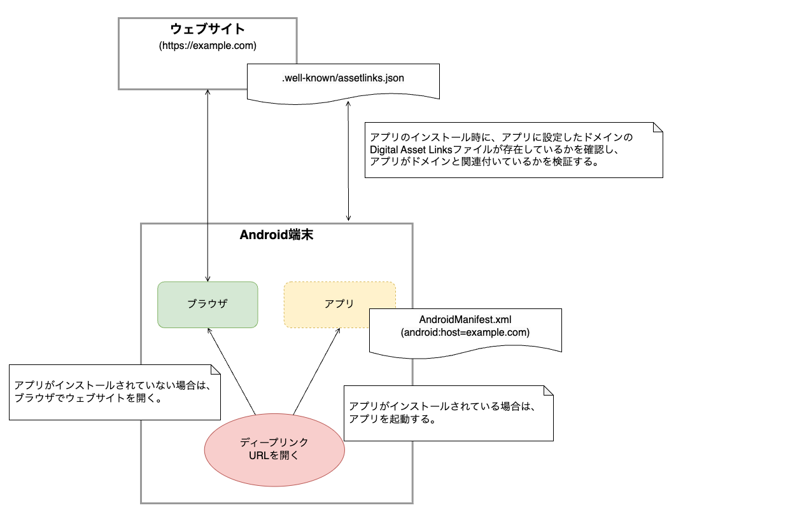

[Android App Links](https://developer.android.com/training/app-links)は、Androidが標準機能として提供しているディープリンクです。

Android App Linksで作成するURLはHTTPリンクであるため、1つのURLでアプリとウェブサイトの両方に対応できます。
また、後述する後述する[アプリとドメインの関連付け](#アプリとドメインの関連付け)により、このアプリが提供するAndroid App Linksを他のアプリに乗っ取られるようなリスクはありません。

## Android App Linksの全体概要

Android App Linksを使用したアプリ起動の全体概要は以下になります。



| 処理            | 内容                                                                                                                                                                                                                                                                       |
|:--------------|:-------------------------------------------------------------------------------------------------------------------------------------------------------------------------------------------------------------------------------------------------------------------------|
| アプリとドメインの関連付け | OSは、アプリのインストール時にアプリの`AndroidManifest.xml`に設定されたドメインの[Digital Asset Links](https://developers.google.com/digital-asset-links/v1/getting-started)を検証します。<br/>Digital Asset Linksには関連付けるアプリを識別するために、アプリケーションIDとアプリの署名証明書のSHA256フィンガープリントを記載します。検証に成功した場合、アプリとドメインが関連付けられます。 |
| ディープリンクURLを開く | ユーザがディープリンクURLを開いた場合、URLのドメインに関連付けられたアプリが端末にインストールされていれば、アプリが起動します。ドメインに関連付けられたアプリがインストールされていない場合は、ブラウザでウェブサイトを開きます。                                                                                                                                                     |

## アプリとドメインの関連付け

Android App Linksは、アプリとドメインを関連付けることでディープリンクURLの安全を保証します。

アプリとドメインの関連付けは、[アプリリンクの検証をリクエストする](https://developer.android.com/training/app-links/verify-android-applinks?hl=ja#request-verify)に記載されている通り、以下の設定が必要です。

- `AndroidManifest.xml`にAndroid App Linksの検証を有効にする`intent-filter`を定義
- Digital Asset Linksファイルをウェブサイトに配置

### `AndroidManifest.xml`にAndroid App Linksの検証を有効にする`intent-filter`を定義

Android App Linksの検証を有効にするには、`AndroidManifest.xml`の`intent-filter`に`android:autoVerify="true"`を定義します。

`intent-filter`内に、以下の要素が存在する場合、OSはアプリインストール時に指定されたドメインのDigital Asset Linksファイルを確認し、アプリとドメインの検証をします。

- action: `android.intent.action.VIEW`
- category: `android.intent.category.BROWSABLE`
- category: `android.intent.category.DEFAULT`
- data scheme: `http`または`https`

```xml title=AndroidManifest.xmlの例
<manifest xmlns:android="http://schemas.android.com/apk/res/android">
  <!-- ～省略～ -->
  <application
    android:name=".MainApplication"
    <!-- ～省略～ -->
    >
    <activity
      android:name=".MainActivity"
      <!-- ～省略～ -->
      >
      <!-- ～省略～ -->
      <intent-filter android:autoVerify="true">
        <action android:name="android.intent.action.VIEW" />
        <category android:name="android.intent.category.DEFAULT" />
        <category android:name="android.intent.category.BROWSABLE" />
        <data android:scheme="https" android:host="[ドメイン]" android:path="/account/profile" />
        <data android:scheme="https" android:host="[ドメイン]" android:pathAdvancedPattern="/questions?page=.+" />
      </intent-filter>
    </activity>
  </application>
</manifest>
```

`data`には`path`や`pathPrefix`、`path[Advanced]Pattern`などを指定することで、特定のパスのみを対象にできます。
詳細は、以下を参照してください。

- [`<data>`](https://developer.android.com/guide/topics/manifest/data-element?hl=ja)

### Digital Asset Linksファイルをウェブサイトに配置

Digital Asset Linksファイルは、アプリと関連付けるドメインに配置するファイルです。ファイル名は`assetlinks.json`とし、JSON形式で記述します。

このファイルには、関連付けるアプリのアプリケーションIDとアプリの署名証明書のSHA256フィンガープリントなどを指定します。

詳細は、以下のドキュメントを参照してください。

- [ウェブサイトの関連付けを宣言する](https://developer.android.com/training/app-links/verify-android-applinks?hl=ja#web-assoc)
- [ステートメント リストを作成する](https://developers.google.com/digital-asset-links/v1/create-statement?hl=ja)

```json title=assetlinks.jsonの例
[{
  "relation": ["delegate_permission/common.handle_all_urls"],
  "target": {
    "namespace": "android_app",
    "package_name": "com.example.app",
    "sha256_cert_fingerprints": ["FA:C6:17:45:DC:09:03:78:6F:B9:ED:E6:2A:96:2B:39:9F:73:48:F0:BB:6F:89:9B:83:32:66:75:91:03:3B:9C"]
  }
}]
```

:::note
アプリの署名証明書のSHA256フィンガープリントは`Java Keytool`を使用することで生成できます。

```bash title=release.keystoreからSHA256フィンガープリントを生成
keytool -list -v -keystore release.keystore
```

:::

Digital Asset Linksファイルは、ウェブサイトの`.well-known`ディレクトリに配置します。

```console
https://[ドメイン]/.well-known/assetlinks.json
```

また、以下の要件を満たして配信する必要があります。

- `Content-Type`が`application/json`である
- HTTPS接続でアクセスできる
- リダイレクトなしでアクセスできる（`301`リダイレクトや`302`リダイレクトがない）
- `bot`がアクセスできる（`robots.txt`で`/.well-known/assetlinks.json`のクロールを許可している必要がある）
- 複数のホストドメインをサポートしている場合、各ドメインでDigital Asset Linksファイルを公開する必要がある（詳細は、[複数のホスト用のアプリリンク機能をサポートする](https://developer.android.com/training/app-links/verify-android-applinks?hl=ja#multi-host)を参照）
