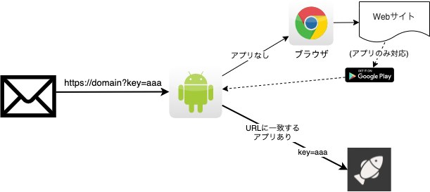

SNSやメールなどでコンテンツのリンクを共有したとき、ユーザが情報へアクセスするときにWebブラウザではなく、ユーザがモバイルアプリケーションを利用してもらいたいことがあります。

## ユースケース

- メールで残高確認のリマンドメールにURLを記載し、モバイルアプリケーションで開いてもらう。残高を確認したあとのアクション（振り込みや資産運用）を銀行が提供しているモバイルアプリケーションで操作してもらう。
- SNSで共有された記事をモバイルアプリで閲覧するときにはモバイルアプリを利用してもらう。
- モバイルアプリのユーザ登録（サインアップ）で検証にメールアドレスを利用し、認証コードを付与したURLを添付したメールを利用する。このとき、メールアプリから検証用URLをタップするとサインアップするモバイルアプリケーションがアクティブになる。

## 基本的な仕組み

モバイル端末でWebサイトのURLを開くと、通常はブラウザでWebサイトにアクセスします。

URLリンクの情報をモバイルアプリーケーションでアクセスしてもらいたい場合、モバイルアプリケーションとURLを紐付けます。このとき該当のアプリケーションにURLの情報を渡すことができます。

ディープリンクでは次のようにモバイルアプリケーションを起動し、URLとして情報を渡します。

アプリがインストールされていないときに、URLからアプリをインストールしてもらうことはできません。
ユーザはアプリではなくブラウザを利用して、該当のURLに対するWebサイトにアクセスします。

## URLの検証

HTTP URLの場合、ドメインとアプリケーションを紐付けているため意図しないアプリケーションに情報を渡すことは防げますが、URLのパラメータ自体が正当かどうかを保証する仕組みは提供されていません。

悪意のあるURLをユーザが利用してしまうことを想定してURLを検証してください。

参考：[Supporting Universal Links in Your App](https://developer.apple.com/documentation/xcode/supporting-universal-links-in-your-app)のWarning（警告）。
